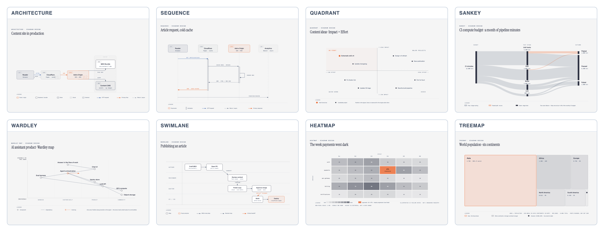
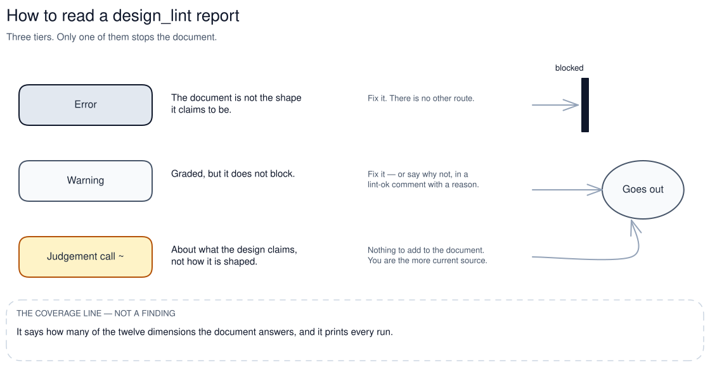
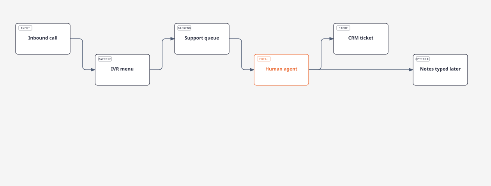
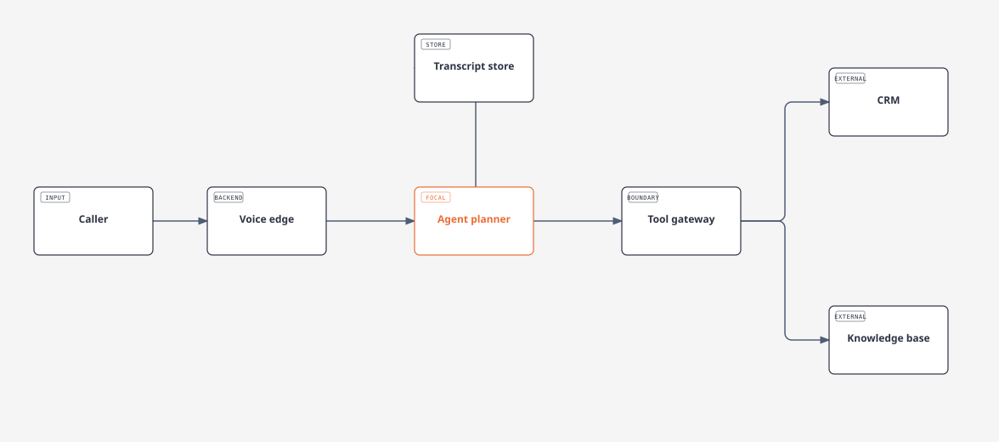
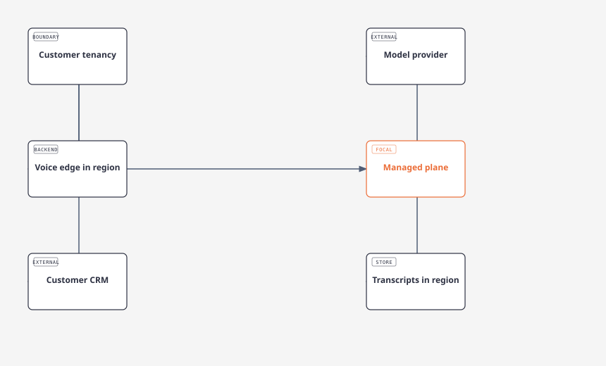
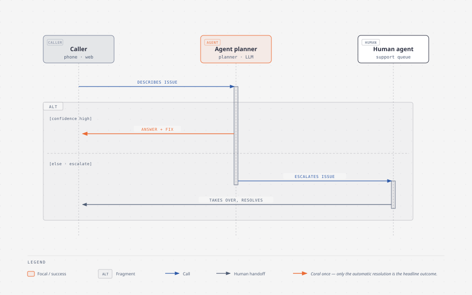
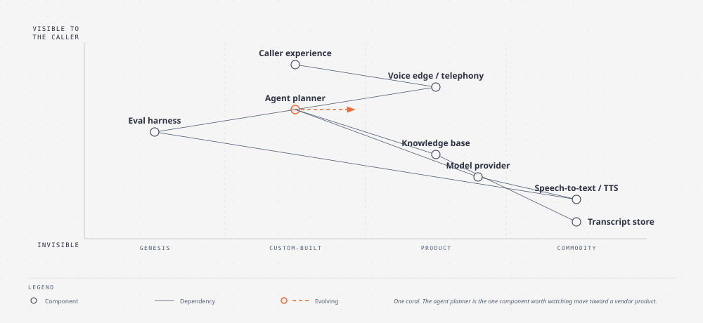
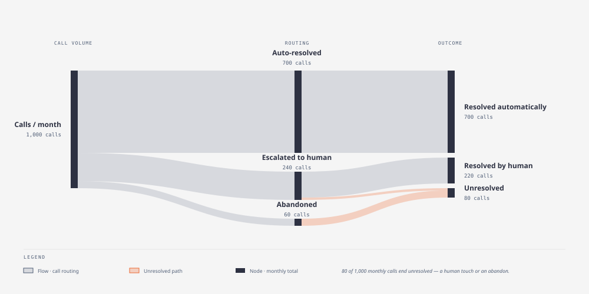

# Pre-sales — the operator's guide

**This file is for humans.** The agent does not read it. When you ask for a solution design, the
agent loads [`plugin/skills/solution-design/SKILL.md`](plugin/skills/solution-design/SKILL.md) — a
long executable procedure written for a machine. This page is the other half: what the machine is
doing, what the words mean, which decisions are yours, and how to read the one gate that can stop a
document going out.

Nothing here is the source of truth for anything. Every fact below is owned by code or by a skill,
and this page tells you which command to ask for. **You never have to type one** — each has a
plain-English version, printed alongside so you can see what actually happened.

---

## 60 seconds

| What you want | Just say | What that runs |
|---|---|---|
| **Prep the technical deep-dive** | *"prep me for the technical deep-dive with them"* | the `solution-discovery` skill |
| **Confirm scope with the buyer** | *"turn the discovery brief into a two-page scope check"* | the `solution-scope-check` skill |
| **Show it** | *"plan the demo"* | the `demo-narrative` skill |
| **Design the solution** | *"design the solution for them"* | the `solution-design` skill |
| **Check the design before it goes out** | *"lint the solution design"* | `uv run python -m gtm_core.design_lint` over the design |
| **See what a design must answer** | *"what does a solution design have to cover?"* | `uv run python -m gtm_core.design_lint --dimensions` |
| **Answer a security questionnaire** | *"answer this security questionnaire"* | the `security-review` skill |
| **Quantify it** | *"build the value case"* | the `value-case` skill |
| **Prove it** | *"plan a POC"* | the `poc-plan` skill |
| **Compete** | *"battlecard for that competitor"* | the `battlecard` skill |

The chain those first few belong to is a graph, and it forks twice:


---

## Aligned with best practice

The structure is not house style. Every dimension a design is graded on comes from a published
architecture template, and the question technique comes from the selling research that has actual
evidence behind it — graded, with the weak claims marked weak. The qualification and questioning
methods include MEDDPICC (enterprise qualification: Metrics, Economic buyer, Decision criteria,
Decision process, Paper process, Implicate pain, Champion, Competition) and SPIN (questioning
methodology: Situation, Problem, Implication, Need-payoff). Commercial and architecture frameworks
add CEB (Challenger commercial insight), JOLT (customer indecision framework), and MADR
(Markdown Architectural Decision Records).


The design is deliberately **not** restructured into arc42 — that is an internal architecture-document
spine, and a customer-facing overview wants the three-tier read. arc42 is used to ask *"does our shape
answer this question?"*, nothing more. The graded canon lives in
[`docs/sales-questions-by-deal-phase.md`](docs/sales-questions-by-deal-phase.md), which says out loud
where popular advice contradicts the data.

---

## Full context

It composes from your material — not from a generic template, and not from what the model happens to
remember about your category.


Each file records where it came from, when it was refreshed, and how often it should be reviewed.
*"show me what this profile knows and what has gone stale"* prints the corpus with its freshness:

```bash
uv run python -m gtm_core.knowledge_index --profile <active>
```

---

## Craft

The right picture for the job, drawn to a spec rather than sketched. A design always carries three —
current-state context, target architecture, and one request end to end — plus the policy fork and the
deployment topology when the use case warrants them. Every one ships with a walkthrough, because you
will not be in the room when it is forwarded.



Beyond the architecture set there is a wider library — the [`diagram-design`](plugin/skills/diagram-design/SKILL.md)
skill holds the layout conventions and a worked exemplar for each type. The rule that decides is
whether the picture keeps the load-bearing part: **a scorecard stays a table**, because a picture of
one loses the evidence column, which is the only column that matters.

---

## Quality control

There is a gate on the artifact, not a vibe check. It is the same shape as the deck linter that
governs slides and the groundedness check that governs outbound.



**The errors are few and each is structural** — a missing tier, a coverage dimension with no section
answering it, a stated count that does not match the list under it. **One warning is worth knowing by
name:** *quality requirements absent*, meaning the design states no availability, latency, throughput
or recovery numbers anywhere. It is a warning by explicit decision, so nothing stops a design shipping
without them — and it is the first thing a customer's architect asks about.

**The judgement calls are yours and cannot be cleared.** There is nothing to add to the document that
removes one. That is deliberate: these four reason about what the design *claims*, and on a claim you
are the more current source — you know what shipped this week and what a customer's beta lifted on
Tuesday. Disagreeing has to be free, and it must not leave a linter comment inside a document the
customer reads. If you drop the same one repeatedly, say so: that is a fact about the check, not the
design.

*"what does a solution design have to cover?"* prints the whole taxonomy with the question each
dimension asks:

```bash
uv run python -m gtm_core.design_lint --dimensions
```

---

## Control

The limits are structural rather than configured. There is no field for a destination anywhere in
this chain — these skills write documents, and sending is a different motion with its own approval.


A refusal is a result, not a malfunction. **No connector bound:** anything reading a CRM, a
product-analytics tool or a feedback inbox checks first and stops — nothing in this repo ships one,
and the alternative is a confident pipeline report built over nothing. **No entry in the evidence
pack:** you get the question, why nothing backs it, and who should own writing it. **No baseline from
the customer:** you get the questions to ask instead of a return modelled on our own guesses. **No
entry for that competitor:** a skeleton and the questions, never a card from recollection.

*"is a CRM connected?"* runs:

```bash
uv run python -m gtm_core.connector_categories crm
```

---

## The words, and what they actually mean

These are used precisely, and the differences decide what happens next.

| Word | What it means here |
|---|---|
| **Discovery** | the call's questions, and the brief that comes back from it. It produces questions, not answers |
| **Design** | the three-tier document: a half-page for the exec, the customer overview, then the technical appendix. Three files, not one scroll |
| **Scope check** | the two-page worksheet the buyer marks up. It asks; it never commits |
| **Proposal** | what is offered, at what total cost, on what paper. Non-binding, and not the contract |
| **Constraint** | fixed, and not ours to choose. A system that stays, a regulator, a change window |
| **Assumption** | ours to be wrong about. If you can decide it, it is not a constraint |
| **Technical win** | a person on their side, by name, has verified a criterion we wrote down first |
| **Enforced / Simulated / Design-target** | shipped today / demonstrated but not enforced / roadmap. Never show the third as the first |

The constraint-versus-assumption line is the one most often blurred. A constraint written down as an
assumption reads as something we might revisit — and their architect is the one who discovers, live
on the call, that we designed against a boundary that never moves.

Three more rules the agent holds you to, because each has cost somebody a deal. First: **a capability claim
ships with a source or it does not ship**. Second: **unsourced claims drift toward *more capable, more
integrated, more ready***. One that flatters the offering is treated as wrong until a line number
says otherwise. Third: **caveats are load-bearing**. *"Configured, not inherited"* reads like the most
trimmable phrase on the page, and deleting it turns an accurate sentence into an overclaim.

---

## The skills, one line each

| Skill | What it is for |
|---|---|
| [`account-dossier`](plugin/skills/account-dossier/SKILL.md) | who they are, what changed recently, and who to ask for |
| [`deck-research`](plugin/skills/deck-research/SKILL.md) | the evidence a deck will need, gathered before anyone opens slides |
| [`call-prep`](plugin/skills/call-prep/SKILL.md) | the next call specifically — it opens the dossier's researched layer first |
| [`account-plan`](plugin/skills/account-plan/SKILL.md) | the multi-week commitment: qualification scored on evidence, every buying influence mapped, a champion ladder with an evidence test per rung |
| [`solution-discovery`](plugin/skills/solution-discovery/SKILL.md) | the question bank. Every question carries the decision it unlocks and the design slot it fills — one that does neither gets cut |
| [`solution-design`](plugin/skills/solution-design/SKILL.md) | the three-tier document, the diagrams, and the technical appendix |
| [`airq-scan`](plugin/skills/airq-scan/SKILL.md) | the risk and assurance read on an agentic design, scored against a rubric rather than sensed |
| [`gateway-runbook`](plugin/skills/gateway-runbook/SKILL.md) | the implementation runbook the design is promising |
| [`diagram-design`](plugin/skills/diagram-design/SKILL.md) | the renderer behind every picture above |
| [`solution-scope-check`](plugin/skills/solution-scope-check/SKILL.md) | the two-page worksheet the buyer marks up |
| [`security-review`](plugin/skills/security-review/SKILL.md) | answers their questionnaire from your evidence pack — and queues every question it cannot back |
| [`value-case`](plugin/skills/value-case/SKILL.md) | the number, with a source and a date behind every figure |
| [`commercial-proposal`](plugin/skills/commercial-proposal/SKILL.md) | what is offered, at what total, on what paper — with a real command as the witness on the year-one total (the AE's step, not the SA's — priced only after scope is confirmed) |
| [`build-deck`](plugin/skills/build-deck/SKILL.md) | the slides, when slides are genuinely the format |
| [`poc-plan`](plugin/skills/poc-plan/SKILL.md) | criteria that can be false, each with a named verifier on their side, and a fail path agreed before it starts |
| [`demo-narrative`](plugin/skills/demo-narrative/SKILL.md) | outcome first, two or three moments, and the interruption plan |
| [`case-study`](plugin/skills/case-study/SKILL.md) | turning the win into the proof the next design gets to cite |
| [`battlecard`](plugin/skills/battlecard/SKILL.md) | where they genuinely win, written first — then everything else |

---

## Where the files go

Everything for one account lands in that account's own folder, and the agent resolves it — ask rather
than typing it. The same company often arrives under two names. The agent looks up the folder the
account already has rather than inventing one from whichever name is in hand. That is why the answer
to *"where does this go?"* is a question for the agent and never something you type yourself. If two
folders could both be the account, it stops and asks you which.

---

## What this page is not

It is not the procedure. The procedure is the skill, and the agent loads it whole — reading half of
one and improvising the rest is a documented, expensive failure in this repo, not a hypothetical.

Related: [`PROSPECTING.md`](PROSPECTING.md) is the same kind of page for the prospecting motion.

---

## Gallery — what the output looks like

A worked example for a fictional company: **Wavelet Interactive**, an AI startup building voice
agents — a sales agent, a support agent, and a chief-of-staff agent over a shared stack. Nothing here
is a real customer, and none of it is a recipe; it is what the artifacts look like when they land.

These first three are rendered by the deterministic pipeline. Brand tokens are resolved from the
tenant's own kit, with an accessible title and description inside each file. Node roles are carried
through as `INPUT` / `BACKEND` / `BOUNDARY` / `EXTERNAL` / `STORE`, with the focal component picked
out.

**Current state — how a support call is handled today**



**Target architecture — the voice agent stack**



**Deployment topology — where each component runs**



The three below are the other renderer — the same **Craft** thumbnails above, hand-authored against
a worked exemplar per type rather than laid out by the deterministic engine. The two paths are not
interchangeable: the deterministic one guarantees brand tokens, escaping and an accessibility layer
on a node-and-edge graph; the exemplar one is what draws a sequence lifeline, a Wardley map, or a
Sankey ribbon. A caption on a real deliverable should say which one drew it.

**One request end to end — resolved live, or escalated to a human**



**Voice agent stack — what to build vs. buy**



**Support call outcomes — where a month of call volume ends up**


