# Prospecting

<p align="center">
  
</p>

Tell it who you sell to. It finds the companies that fit, the right person at each one, and
something that actually happened there that makes now the time to write. It drafts the email, and
once you approve the list, stages it **paused** in your sending tool. You read it. You press start.

*This page is for humans: what the agent is doing, and which calls are yours. The agent never
reads it — it follows the [`prospect` skill](plugin/skills/prospect/SKILL.md).*

<p align="center">
  
  
  
  
  
</p>


---

## Why you can point it at your best accounts

The fear with any AI prospecting tool is that it emails your best accounts something wrong, stale,
or generic under your name. This one is built the other way round: it would rather hold an email
than send a bad one.

- **Nothing sends without you.** It drafts and stages. The sending tool it talks to gives it no
  start button, so going live is always a person pressing one. ([§1](#1-what-it-will-never-do))
- **What it says about you, you wrote.** Claims about your product come from a fact sheet you own,
  each marked verified, conditional, or roadmap. Research decides *who* and *why now*; it never
  writes to that sheet, and a draft quoting a figure you have marked disputed is refused.
  ([§9](#9-the-quality-bar--for-whoever-reads-the-drafts))
- **It says "unknown" instead of guessing.** A company it could not research is labelled with what
  is missing, not handed a low score. A company with no real reason to write waits for your call
  rather than getting a generic email by default. ([§2](#2-the-words), [§5](#5-the-decisions-only-you-can-make))
- **It won't pitch old news.** Every reason to write is dated. Once it goes stale, the account goes
  back for a fresh one. ([§11](#11-frequently-asked-questions-faq))
- **It can't overspend.** Your budget cap is a hard stop, checked before every paid call. It
  confirms the data providers work before spending anything, and it never buys credits.
  ([§0](#0-before-your-first-run))
- **It never forgets a no.** Every company it has looked at stays on file, rejected ones included,
  and your do-not-contact list survives every rebuild. ([§2](#2-the-words))
- **It learns, but only from evidence.** An angle is kept on real replies and retired when it
  fails; a small sample is called *too early*, never a win. Too many opt-outs on one batch and the
  next one is refused. ([§7](#7-how-it-gets-better))

## What it asks of you

- **Once:** say *"set me up"*. It reads your website and drafts your profile. Then check the few
  files that decide who qualifies — your ICP, your ideal customer profile: the kind of company you sell to best. ([§0](#0-before-your-first-run))
- **Each run:** a handful of decisions — send a generic email or hold for research, spend on
  research or not, what to do with the accounts it parked — and pressing start in your sending
  tool. Silence never sends: an unanswered question keeps the accounts held.
  ([§5](#5-the-decisions-only-you-can-make))
- **Money:** it runs on free web search. A paid contact provider is what turns a scored list into
  one you can send to, because only then are the addresses verified. ([§0](#0-before-your-first-run))
- **After it sends:** read the replies it drafts and send the ones you like. It never answers a
  prospect for you. ([§6](#6-after-you-press-start))

## Start here

You never type a command. Say the sentence and the agent runs it; the command is printed beside it
so you can see what happened. No number on this page is copied from your data — ask, and you get
today's.

| What you want | Just say | What that runs |
|---|---|---|
| **Set up (once)** | *"set me up"* | the `setup` skill |
| **Start a run** | *"run my prospecting"* — add a market, a segment, or a number to scope it | the `prospect` skill |
| **See where you are** | *"refresh the prospecting status page and tell me where we are"* | `uv run python -m gtm_core.email_campaign_dashboard --profile <you> --scope open` |
| **How many can I send today?** | *"how many can I send today?"* | reads the *Today* line off that page — the checks' answer, never a hand count |
| **Refresh the checks** | *"run the prospecting checks again"* | `uv run python -m gtm_core.preflight_report --profile <you> --warn-only` |
| **Find your files** | *"where do my prospecting files live?"* | `uv run python -m gtm_core.prospects paths --profile <you>` |
| **What can this thing do?** | *"what prospecting commands are there?"* | `uv run python -m gtm_core.prospects` |
| **Decide the parked rows** | *"show me the accounts waiting on a decision from me"* | builds the review sheet — see §5 |

## Find your question

The rest of this page goes deeper, one question at a time.

| If you're asking… | Read |
|---|---|
| What do I check before the first run? | [§0 Before your first run](#0-before-your-first-run) |
| What will it never do? | [§1 What it will never do](#1-what-it-will-never-do) |
| What does this word on the status page mean? | [§2 The words](#2-the-words) |
| Where are my files? | [§3 Where everything is](#3-where-everything-is) |
| What does a normal week look like? | [§4 The week](#4-the-week) |
| What is waiting on me? | [§5 The decisions only you can make](#5-the-decisions-only-you-can-make) |
| Someone replied, unsubscribed, or booked a meeting — now what? | [§6 After you press start](#6-after-you-press-start) |
| What's working, what gets cut, and what stops a bad batch? | [§7 How it gets better](#7-how-it-gets-better) |
| Can I trust this number? | [§8 Reading the numbers](#8-reading-the-numbers-without-being-misled) |
| Can I trust this draft? | [§9 The quality bar](#9-the-quality-bar--for-whoever-reads-the-drafts) |
| Something looks broken | [§10 When it looks wrong](#10-when-it-looks-wrong) |
| Do I lose credits if it stops? Can two people run it? | [§11 FAQ](#11-frequently-asked-questions-faq) |
---

## 0. Before your first run

**Setting up the engine itself** — installing it, connecting your data providers, setting a budget
cap — is one conversation and it is documented in the main README: [Getting
started](README.md#getting-started-chat-mode) and [Tools &
keys](README.md#tools--keys). Say *"set me up"* and the engine reads your website, drafts your
whole profile, and asks only the handful of things a website cannot tell it. Do that first.

What follows is the part that is specific to prospecting, and it is the part that decides whether a
run produces qualified accounts or plausible-looking noise.

### Prospecting reads your profile. Fill these in or it guesses.

Onboarding scaffolds every one of these files, but it scaffolds them as **templates**. A run will
happily proceed against a template and hand you output that looks finished.

The three that ship **inert or fictional** — `premise-vocab.toml`, `competitors.toml`, and a
stub `icp-personas.md` — are the ones worth checking by hand before a first paid run. They fail
quietly: the pipeline does not error, it just stops catching things.

<details>
<summary><b>Every file a run reads — and what goes wrong if it is still a template</b></summary>

| File in `profiles/<you>/knowledge/` | What prospecting uses it for | If it is still a template |
|---|---|---|
| `icp-personas.md` | **The gates and the scoring rubric.** The single most important file — it decides who qualifies and what they score. | Nothing is really being scored. Every account looks equally good. |
| `competitors.toml` | Deciding what an account *is to you* — prospect, competitor, partner, regulator. | Ships with fictional companies, so a real competitor can be scored as a prospect and emailed a pitch. |
| `premise-vocab.toml` | The "can an argument actually rest on this fact?" check. | **Ships deliberately inert** — every entry is empty, so the check is off. Research passes that should have been caught reach the draft. |
| `case-studies.md` | The proof story matched to each account. | Drafts cite nothing, or cite the template's placeholder. |
| `claims.toml` | What an email may say your product does, each with a status — see §9. | Every example ships as roadmap, so nothing about your product can be stated as fact. |
| `proof.toml` | The numbers and references an email may quote, picked for the reader's country. | The examples are shapes, not measurements, so no figure can be quoted. |
| `angles.toml` | The written-down pairings of who you write to, what you argue, and how you open. | Ships empty — there is no angle for any row. |
| `role-vocabulary.toml` | What each job title struggles with, and the tone to take with them. | Optional. Without it a built-in business-software vocabulary is used, which puts the pain on the wrong desk if your buyers are a different shape. |
| `hook-matrix.md` | The opening ideas as a grid. **Once your profile has angles, this file is generated from `angles.toml`** — its first line says so — and an edit to it is lost on the next run. Edit `angles.toml` instead. | The opener gets free-written instead of chosen, which is how a whole run ends up sounding the same. |
| `voice.md` | Every line in a Tier-A pack is checked against it. | Copy reads like the model, not like you. |
| `market-scan-config.md` | Which buyer-intent topics count as heat for your category. | Intent never fires, so nothing is ever timed. |

</details>

### What you get with no paid connectors at all

Prospecting runs on free web search alone. You still get discovery, scoring, research and drafts —
but every email address is marked **unverified**, which means nothing reaches the loadable list
until it has been verified some other way. Connecting a contact provider is what turns a scored
list into a sendable one. The trade-offs per tool are in [Tools & keys](README.md#tools--keys).

### Am I ready?

Two checks, both free, both worth doing before the first run that spends anything:

- *"check my environment"* — the keys and their fallbacks:

  ```bash
  uv run python -m gtm_core.check_env
  ```

- *"check my prospecting connectors before we spend anything"* — the agent probes each provider
  and maps what is live onto what this run actually needs (discovery, intent, contacts). It
  **stops the run** rather than spending on a run that cannot finish. A prospecting run does this
  for you every time; running it yourself first just means finding out before you have asked for
  anything.

One number to set deliberately: your **monthly and per-run budget cap**, recorded in your profile
during setup. It is a hard stop, checked before every paid call — not a warning.

---

## 1. What it will never do

**It never sends anything.** Not an email, not a LinkedIn message, not a calendar invite. This is
structural, not a setting:

- The prospecting run produces **drafts and lists**. That is its entire output.
- The `email-sequence` step loads a list into the sending tool and leaves the sequence **PAUSED**.
  There is no resume button available to the agent — the tool it talks to does not expose one.
- **A human opens the sending tool and starts the sequence.** That is the only way an email leaves
  this system, and it is the same shape as the publish gate on the content side.

So if you are waiting for the machine to "just start emailing", it will wait forever. That step is
yours, on purpose. When a prospect replies to an outreach sequence, the engine analyzes the
message and drafts a response for your review — it never sends an automated reply back to the prospect.

**What about scheduled runners and cron?** A background schedule or recurring runner may only ever
automate the **discovery and backlog refresh** (finding accounts, refreshing signals, updating
qualification scores). Loading contacts into a sequencer and starting sends remains strictly 100%
human-steered behind your explicit review.

**It also never buys anything.** If credits run low it tells you and stops. It will not top up a
plan, buy a bigger tier, or spend past the cap in your profile.

---

## 2. The words

### Four things act on your list. Only one of them is you.

- **The router picks which email a person could get** — a personalised one, a generic one, a
  re-draft, or none yet. That is sorting. It is not permission.
- **The checks decide whether it may go.** They read the account behind each row and either
  **pass** it or **refuse** it, one named reason at a time.
- **The judge rates the copy.** It scores how a draft reads. It ranks; it removes nobody.
- **Nothing sends without you.** You start the sequence in the sending tool yourself, every time.

**Sorted is not checked.** Someone the router has sorted has not yet been through the checks, so
those two counts are different numbers and the sorted one is always the larger. When a report says
**passed** or **refused**, that is the checks talking — those are the only two words for it, and a
report that says anything vaguer is not telling you which of the two happened.

Below are the nouns. They appear in every file and on every page, they are not interchangeable, and
three of them get misread often enough to have caused real incidents.

| Word | What it means |
|---|---|
| **Account** | A company. Scored against your ICP, and kept permanently in the account ledger — including the ones you disqualified, so the same company is never re-sourced and re-decided from scratch. |
| **Contact / row** | A person at that account. One account can be several rows. Lists are rows; the ledger is accounts. |
| **Tier (A / B / unscored)** | A **score band**, nothing more. Tier-A clears the profile's high threshold and earns a hand-built 1:1 outreach pack; Tier-B goes into the shared sequence. **Both get sent.** Tier is how much effort the account earns, not whether it is worth contacting. `unscored` is not a third band below B — it means the row was never scored at all; see "Scored vs categorised" below. |
| **Heat (0–3)** | *Timing*, not fit. Points added when a buyer-intent feed shows the account researching your category right now. Two feeds agreeing is worth more than one. Heat picks the week to reach out; it never appears in the copy. |
| **Verdict** (`send` / `re-angle` / `drop`) | **The researcher's** conclusion about one row. `re-angle` = real account, wrong story. `drop` = competitor, dead, or wrong entity. Written once, never overwritten by a machine. |
| **Judge verdict** | A separate column written by the automated reader. It **ranks and never removes** — unless it has been calibrated against a sealed human-labelled set, it cannot delete a row from your list. Do not read it as the researcher's finding. |
| **Lane** | Which *kind of email* a row can carry: `personalised` (opens on this account's own researched fact), `repair` (fixable draft, needs a re-write), `generic` (makes no claim about the recipient at all), `hold` (waiting on your decision), `excluded` (suppressed, opted out, or already enrolled elsewhere). |
| **Passed the checks** | The checks read this row's account and let it through. Safe to load today. |
| **Needs verification** | We have an address but not confidence in it. Never load blind. |
| **Suppressed** | On the durable do-not-contact ledger. Survives every rebuild — this is the one exclusion that cannot be lost. |
| **Wave** | One batch of sends, measured as a unit. |
| **Overlay** | A named experiment. It swaps your targeting files — a different ICP, a different set of criteria — for **one run only**, so you can try an idea without editing the live ones. It has an expiry, it is never assumed, and you have to name it each time. Results from an overlay run stay labelled, so they never quietly become your baseline. |

### The status word — one word, six values, always derived

Every row (and every account in the ledger) also has a **status** — the one word that answers
"whose move is it?" It is never stored anywhere. Asking for it re-derives it fresh from today's
route and today's ledger every time, so — unlike a count copied into a document — it can never go
stale.

| Status | Whose move |
|---|---|
| **Waiting on you** | yours — one decision |
| **Sorted — not yet checked** | the checks, then yours |
| **Being reworked** | the engine's — nothing for you to do |
| **In the sending tool** | already loaded — do not load again |
| **Closed — not contacting** | closed |
| **Still finding the right person** | the engine's — it looks first, then asks you if it cannot find one |

Ask, don't memorise — *"where do I stand right now?"*, or run it yourself:

```bash
uv run python -m gtm_core.prospects status --profile <you>
```

The report opens with a few plain lines, then the detail. The lines, in order:

- **As of** — when the report was made, and when the checks last ran.
- **Today** — how many people on the list can go out. If none can, it says why and what unblocks
  it, in one sentence per batch. If the list changed after the checks last ran, it says
  *unknown* and asks you to run them again: an old answer is never shown as today's.
- **Yours** — how many contacts are waiting on your decision, and where the review sheet is. This
  is always the **Waiting on you** number. It is a decision, not a warning. A second *Yours* line
  appears only for a real risk: someone already loaded in the sending tool at a company that is
  now closed to sending — outside your target markets, on the do-not-contact list, a competitor.
  It says how many and why, because only you can take them out of the sending tool.
- **The machine's** — what is being worked on without you: finding contacts, researching
  companies, sorting, re-drafting.
- **In the sending tool** — how many are loaded. Nothing sends until you start a sequence there.
  The status page's Overview shows each campaign's go-live word (*started*, *staged*, *unknown* …),
  the people it has contacted, and the date of those figures. It says *live* or *paused* only when the
  sending tool's figures carry that status. The terminal cannot see any of that, so it does not
  guess.

Some companies are kept off the send list **automatically**, with nothing for you to decide:
companies outside your target markets, and companies not yet researched enough to score. The
second kind rejoins the list by itself once it is researched. Tier C companies are a fit and get
the general email like any other.

Under **For the record** comes the detail, in two parts that count different things on purpose.
The first counts **companies** — *Not a fit / excluded*, *Being researched*, *Finding a contact*,
*Not yet sorted*, *Held*, *Sorted*, and *All accounts*. An account's word is the furthest any of its
contacts has got. The second counts **people** on your current list, by the first five statuses
above. Beside them sits **Passed the checks** — the same people counted by a later step, never
added into the list total, and shown as *not run yet* or *out of date* whenever the checks have not
seen this exact list. Underneath sit two lines about the account ledger: **Needs an address** (no
contact resolved yet) and **Checking the address** (one was found and is being confirmed — those
accounts join the list once it is). The two parts never add up to each other, because one
company can be several people. The report always says which population each line covers. A total
that silently mixed them would be the same double-counting mistake this pipeline has already
paid for once.

Every person on the list is counted exactly once in the **Today** line's numbers: the ones that
can go out, and the rest by reason. If a count ever lost someone, the report says *unknown*
instead of showing a smaller number.

### The three that get misread

1. **"Only 2 Tier-A" is not a bad run.** Tier-A is the *pack* tier. A run can produce two Tier-A
   packs while several hundred rows sit perfectly sendable in other lanes. Always read the tier
   count and the lane split together — the skill is required to report them side by side.
2. **A row in a lane is work queued, not work rejected.** `hold` needs a decision from you.
   `repair` needs a re-draft. `generic` needs your say-so. None of them means "we found nothing".
3. **`re-angle` does not mean unusable.** It means the *personalised* story failed. The row is
   still enrollable on a generic body — that is the whole point of separating verdict from lane.

### Scored vs categorised — the difference worth more than the score

An account comes back one of two ways, and they are **different kinds of answer**, not a good
score and a bad one:

* **Scored** — it had everything the rubric needs, so it has a number and a tier. You can argue
  with a number. Each one comes with a plain sentence naming every axis and what it cost the
  account, which is what you read when a score looks wrong.
* **Categorised** — the rubric **refused to guess**. Something it needs is missing, and the row
  says which: *no ICP label*, *agent activity not assessed*, *no buyer-intent reading*, *no
  research on file*. These are not weak accounts. They are **a work queue**, and the category is
  the next action.

**Why this exists.** Before it, a row nobody had researched got a *low number*, which looks
exactly like a row we researched and found weak — and nothing looked broken, because a wrong
number looks exactly like a right one. (The run that forced the change, and the rule that came
out of it, are written up in `docs/RULES.md` §R19.)

**So the two rules for reading it are:** a categorised row is never "low priority" — it is
*unknown*, and cheap to resolve. A scored row was scored against a **named** rubric, recorded
with the row. If you change the rubric, past scores keep saying which one they came from. That
way, a change in reply rate can be traced to the rubric rather than to luck.

**"Blocked — outside target markets"** is the one category that is not a work queue: it is a
decision already made, and no amount of research changes it.

---

## 3. Where everything is

Ask, don't memorise — *"where do my prospecting files live?"*, or run it yourself:

```bash
uv run python -m gtm_core.prospects paths --profile <you>
```

That prints the account ledger, the one loadable list, the hold queue, the suppression ledger, the
per-account folders, the outcomes log, and the status page. Each has a one-line note, and
anything that does not exist yet is marked.

Two rules about those files:

- **The account ledger is the record. The CSVs are views.** Editing a pooled CSV by hand does not
  stick — those files are rebuilt from scratch on the next build and your edit is discarded. If a
  fact is wrong, fix it on the account, not on the row.
- **Two loadable files, dated — never a bare "the" list.** A route produces a personalised list and
  a generic list, each stamped with the date it was cut. Those are the only two you may load.
  Everything else lives in a hidden pool folder. That includes rows being fixed, waiting on your
  decision, or already loaded elsewhere. Browsing the sequences directory shows you only the
  files you are allowed to load.
- **Nothing is cleaned up automatically — ever.** Tidying away old export files is something you
  ask for, never something a run does on its own. When you ask, you first get a plan of what would
  be archived, and nothing changes. Acting on the plan is refused while any email campaign is
  still unfinished, and there is no override. Do-not-contact and reply records are never removed,
  and an archive is a compressed copy kept aside, not an erasure. Your staged work will not be
  deleted out from under you before you can send it.

---

## 4. The week

**Monday — the run.** Say *"run my prospecting"*. Before spending anything the agent checks that
the data providers are actually reachable and that the run can hit the number you asked for. If it
cannot, it stops and tells you what to fix. That refusal is the feature: a run that spends money
discovering accounts it can never get contacts for is unrecoverable.

**When you name a number, it means delivered contacts, not companies discovered.** That gap is
where runs go wrong. Every stage of the funnel loses some, and the cumulative loss is brutal.
A run sized as if discovery equalled delivery lands a fraction of the ask after the money is
spent. The agent sizes for it up front and will tell you the shape it expects. If the
number you meant was companies, say so.

**Mid-week — the decisions.** See §5. This is where the pipeline actually waits on you.

**End of week — the read.** Open the status page. Before the next batch is staged, the previous
one's reply rate has to be on file — *"has the last wave been measured yet?"*, or:

```bash
uv run python -m gtm_core.prospects wave-gate check --profile <you>
```

It does not judge the number — it only refuses to let you stage a new batch while the last one is
unmeasured.
What that measurement feeds — and the opt-out tripwire — is [§7](#7-how-it-gets-better).

---

## 5. The decisions only you can make

The engine is deliberately unable to make these. If you do not answer, work stops here — silently
in some cases, which is why they are listed together.

**1. Generic-lane routing.** *"N accounts cleared the fit gates but have no usable signal. Route
them to the generic lane, or hold them for research?"* — a generic body asserts nothing about the
recipient, so it structurally cannot make a wrong claim about them. It trades reply rate for
truthfulness. There is a cap (in your profile's settings) on what share of a run may be generic,
so this can never quietly become the default. **If you say nothing, the rows stay held.**

**2. Research spend.** *"N accounts have no dossier — generate them?"* — this is the only
variable-cost step in a run, so it always asks. Tier-A candidates get the fuller brief; everything
else gets a cheaper markdown research pack.

**3. Credit top-ups.** The run tells you when a provider is running low. It will never buy.

**4. Held rows.** *"Show me the accounts waiting on a decision from me."*

Rows flagged as competitor-adjacent, partner, prior contact, negative reply, or strategic account
get parked in a review sheet. You have three choices for each: **suppress** (never contact),
**generic** (send, but claim nothing), or **salvage** (worth a different fact, a different argument,
a different person, or a revisit date). **Leaving it blank keeps the row held** — silence never sends
and never suppresses.

**5. Go-live.** Someone opens the sending tool and starts the paused sequence. Only you can do it.

**6. What to do about a weak criterion.**

Before a run spends anything, the system checks your ICP definition itself and reports what it
finds. It flags phrases that match no company, or ones so broad they catch the whole market. It also
flags personas that no contact matches, or a scoring rubric that ranks everything the same. You will
also be offered **add / amend / retire** suggestions, each naming the file, the change, and the
evidence behind it.

**Nothing is changed for you.** The system prints the suggestion; editing the file is yours, and it
stays yours — these criteria decide who the company sells to, so a change nobody chose is the one
outcome worth preventing. A finding does **not** stop the run either: a weak criterion is still
your criterion, and refusing to prospect on it would be the tool overruling you.

Two things worth knowing about what it tells you. A broad match is not automatically wrong, because an
industry category *should* match hundreds of companies. Free-text phrases are different: when they
are too broad, they stop being a signal. Those are the ones you will be asked to look at.
And a clean result means your criteria are answerable, not that they are *right*: whether this is
the correct ICP is a question only replies can settle, and the system says so itself.

### And one that looks like yours but isn't: the provider's download buttons

When a data provider's panel appears in the chat offering **"Download N rows"** or **"Export N rows"**,
neither button is your decision. Do not click either.

- **Download** hands the file to your browser, not to the pipeline. Rows have to land in your profile's
  own folder to be scored and merged; a file in your Downloads folder never gets there. Worse, these
  share links are **single-use** — clicking one consumes the link the engine was about to fetch, and the
  run then cannot read rows you have already paid for.
- **Export** spends credits. It bills outside the check that tests your monthly cap first, and the spend
  never reaches the ledger — so your cap silently drifts and the run's reported cost is wrong.

The engine fetches these files itself, into the right folder, without consuming anything you need. If
you want a copy for your own use, ask for it in words — *"give me these accounts as a spreadsheet"* —
and you get one built from your own folder after the rows are scored. Every run already writes a
CRM-ready CSV at the end, so most of the time it exists before you ask.

---

## 6. After you press start


Replies come back to your sending tool. Ask *"who replied?"* and it reads them, sorts each one, and
drafts where a draft helps — on a server install, a scheduled check does this every few hours
without being asked. Whatever the reply, **anything that goes back to the prospect goes through
you.**

**● works today · ◐ partly · ○ planned.** This section describes where prospecting is going, not
only where it is, and the marks say which is which.

| When they… | It… | You… | |
|---|---|---|---|
| **say yes, or ask to talk** | drafts a reply — with your booking link, if your profile has one | edit it and send it | ● |
| **ask about price, or how to buy** | alerts you and drafts nothing — too important to guess at | answer it | ● |
| **say not now, or not interested** | records it and keeps the account off every new list | nothing | ● · a revisit date ○ |
| **are out of office** | leaves it to your sending tool, which pauses them and picks up again on their return date | switch that setting on in your sending tool, once | ◐ only as good as that setting |
| **say stop, or click unsubscribe** | alerts you and keeps them off every new list; the unsubscribe link removes them in your sending tool too | approve adding them to your permanent do-not-contact list and the sending tool's own | ◐ the approval step is not live yet |
| **book a meeting** | logs it against the account | nothing | ◐ logged when you *"sync outcomes"*; straight from your scheduling tool ○ |

Until that do-not-contact approval step is live, make it permanent yourself — *"add [person] to the
do-not-contact ledger, permanently"*. It takes one sentence, and it is the one exclusion that
survives every rebuild.

---

## 7. How it gets better

![The learning loop. A batch goes out; replies are counted once at least twenty are sent; the batch is measured before the next one can go; results are read per angle; each angle is kept, watched or retired, and you promote or retire it before the next batch. A tripwire off the measurement step: opt-outs over the ceiling refuse the next batch, and you pause the running sequence in your sending tool, because the system cannot. A side column sharpens the aim: an ICP check you act on, a staged knowledge refresh, and three planned pieces — one-run experiments, cost per reply and per meeting, and a random holdout](docs/assets/prospecting-learning-loop.svg)

**Nothing scales until it has been measured.** A new batch cannot be staged until the last one's
replies are on file, and a batch needs at least 20 sent before its reply rate is read at all. Below
that, one reply either way is noise, and it is reported as noise.

### What gets measured

| Measure | |
|---|---|
| Sent, replies and meetings, per batch | ● |
| Replies, positive replies and meetings, per angle | ◐ every send carrying its angle is planned |
| Opt-outs per angle | ○ |
| Cost per reply, and per meeting | ○ |
| A random holdout — would they have replied anyway? | ○ |

Say *"sync outcomes"* and it pulls the latest from your sending tool, then writes up what is doing
clearly better or worse than your average. It flags; it never acts on what it finds.

### Keep, watch, or retire

Every angle lands in one of three places, and **you** move it — the commands are in
[§9](#9-the-quality-bar--for-whoever-reads-the-drafts).

- **Keep.** Real replies behind it, and a claim you have verified. You promote it to live.
- **Watch.** Too little data to call, so it keeps running. An angle is never retired for being
  unlucky on a small sample.
- **Retire.** You stop it. No evidence needed — stopping is always allowed — and it stays on file
  as a record of what did not work.

**Be honest about sample size.** Telling a twice-as-good angle from luck takes a few hundred sends
each; telling one that is 30% better takes thousands. So early on, most answers are *watch* — and
that is the right answer, not a failure.

### Tripwires — when a batch goes wrong

| If… | Then… | |
|---|---|---|
| the last batch has not been measured | the next one is refused | ◐ |
| opt-outs cross the ceiling — 5% on a batch of 30 or more, or more than 3 on a smaller one | the next batch is refused, with the reason; only an explicit *"I know — go ahead"* overrides it | ◐ |
| the opt-out count does not add up | the next batch is refused until it does | ◐ |
| bounces or spam complaints climb | your sending tool's own health numbers stop the next batch | ○ |

◐ here means the check exists and the prospecting procedure runs it before every batch; making it
impossible to skip is planned.

**It cannot pause a sequence that is already running** — by design, because it cannot start one
either. When a tripwire fires, pausing the live sequence in your sending tool is yours, and it is
the fastest fix there is.

### Sharpening the aim

- ● **Your ICP gets critiqued, not just used.** Before a run spends anything it flags criteria that
  match nothing or everything, and suggests lines to add, amend or retire. You edit; it never does.
- ● **Knowledge refreshes, staged.** New material is proposed for you to approve, never applied.
- ◐ **Experiments.** Try a different ICP or angle set for one run without touching the live one;
  the results stay labelled, so they never quietly become your baseline. The mechanism exists; runs
  do not use it yet.
- ○ **Your judgement trains the reader.** You label a sample of drafts, and the automated reader is
  calibrated against your labels before it may do more than rank.
- ○ **What customers say feeds the messaging.** Objections and phrases from real replies and calls
  flow back into the angles and the pains.

| What you want | Just say | What that runs |
|---|---|---|
| **Has the last batch been measured?** | *"has the last wave been measured yet?"* | `uv run python -m gtm_core.prospects wave-gate check --profile <you>` |
| **Pull results and flag what's working** | *"sync outcomes"* | the `outcomes-sync` skill |
| **Critique my ICP** | *"check my ICP definition"* | `uv run python -m gtm_core.prospects icp check --profile <you>` |
| **Suggest ICP changes** | *"suggest changes to my ICP"* | `uv run python -m gtm_core.prospects icp propose --profile <you>` |

---

## 8. Reading the numbers without being misled

- **"How many can I send" is one number, from one place** — the *Today* line on the status page.
  Not a count of rows in a CSV, not a sum across files, not yesterday's figure.
- **Never add up scoring runs.** Re-reads cover the same people, so summing them double-counts. The
  tally tool reports a **range** (strict agreement → any agreement) plus how many are contested.
  Quote the range; a single number from one pass is a draw, not a measurement.
- **A per-cent with no denominator is a wrong finding waiting to happen.** "74% of rows fail" is
  only meaningful against the population it was measured on.
- **The score column is a qualification verdict, not a spend ranking.** Two different scorers on
  two different scales have landed in that column before. If a score looks impossibly high, it is
  probably the other scale.

---

## 9. The quality bar — for whoever reads the drafts

### What an email may say about you

A draft mixes two kinds of information, and they never come from the same place.

**About them — researched fresh on every run.** Who the person is, whether the company fits, and
the *signal*: the thing that happened at their company that makes now the right time. This is
research, so it can be wrong. The second half of this section is how you catch that.

**About you — your profile's fact sheet, the same for every account.** What your product does, the
numbers you can quote, what each job title cares about. Research never writes to it. A bad
research result can misjudge a company; it cannot make an email say something false about your
product.


Every email is built from five parts, and each part has one home:

| Part | What it is | Where it comes from |
|---|---|---|
| **Signal** | why we are writing now | this account's research |
| **Claim** | what we say the product does | `claims.toml` |
| **Pain** | what this person's role usually struggles with | `role-vocabulary.toml`, by job title |
| **Hedge** | the honest qualifier | `voice-rules.toml` |
| **Proof** | the number or reference behind the claim | `proof.toml`, picked for the reader's country — some countries deliberately get none |

The writer does not choose these one by one. It picks one **angle** from `angles.toml` — a pairing
of who we are writing to, what we argue, and how we open — and the angle names the rest. When no
angle fits a row, the row is refused with a reason rather than free-written.

**Every fact carries a status**, and the status decides what an email may do with it:

| Claim status | Means | May an email state it as fact? |
|---|---|---|
| `verified` | you hold the evidence, and the entry names the exact file and line it is in | yes |
| `conditional` | true only under a condition | only with the condition said |
| `design-target` | roadmap | never |

For numbers: `measured` may be quoted, `illustrative` is a shape rather than a figure, and
`disputed` is refused in any draft that uses it. When a figure is retracted, you change its status
once, and every draft leaning on it is refused from then on — no hunting through old copy.

A draft written before angles existed names none, and is only partly checked. A `disputed` figure
or a phrasing a claim forbids is still refused. But a figure with no `measured` proof is only
warned about, and the claim's status is not checked at all. The check says so out loud, in a
warning called `angle-missing` — read it as "this draft was not fully checked", not as noise.

**Angles earn their place on replies, not opinion.** An angle is `draft` (may be tried), `live`
(has earned it), or `retired` (stopped, and kept as a record of what did not work). Moving one is a
command, never a file edit — [§7](#7-how-it-gets-better) covers when. Promoting needs the angle's sent and reply counts, and is refused
outright when the angle's claim is not `verified`. Retiring needs no evidence — stopping is
always allowed.

| What you want | Just say | What that runs |
|---|---|---|
| **Check the fact sheet is valid** | *"check my messaging registry"* | `uv run python -m gtm_core.messaging check --profile <you>` |
| **See the angles as a grid** | *"regenerate my hook matrix"* | `uv run python -m gtm_core.messaging matrix --profile <you>` |
| **Find angles nothing uses** | *"which angles is nothing using?"* | `uv run python -m gtm_core.messaging unused --profile <you>` |
| **Promote an angle** | *"promote angle X — here are its numbers"* | `uv run python -m gtm_core.messaging angle promote --id X --evidence 'sent=<n> replies=<n>'` |
| **Retire an angle** | *"retire angle X"* | `uv run python -m gtm_core.messaging angle retire --id X` |

**Keeping it current.** The rest of your knowledge refreshes the usual way — the machine proposes,
you approve: *"refresh my knowledge"*, then *"show me what's staged"*
(`uv run python -m gtm_core.knowledge_staging list --profile <you>`). The fact sheet is the
exception. Nothing proposes changes to `claims.toml` or `proof.toml` for you yet: add or change the
entry by hand, then run the check above. A new case study or a retracted figure is that kind of
edit.

### Whether the researched fact is good enough

A researched fact has to survive two tests before it can open an email. Both are things you can
check by eye in a draft:

**Can it ship?** The opening clause must be a plain sentence that quotes no numbers, carries no
date stamp, cites no URL, and is a faithful reduction of the source — not a re-wording of it.
Freshness and provenance are recorded as data on the row; they do not belong in the sentence. The
most common casualty here is a funding round: the money can never be the opener. Keep looking for
what the money *bought*.

**Can it carry an argument?** A fact can be fresh, sourced, on-topic, about the right company, and
still be useless because no pitch can rest on it. "They built an agent" is a *filter* for who to
talk to, not a premise a message can assume.

**Reject a draft when:**
- It claims something plural when the evidence shows it once.
- The fact is about the parent, investor, or acquirer rather than the recipient.
- The word "agent" in the clause means human agents (like insurance agents), but the body treats it as AI.
- A capability is described as shipped when it is still on the roadmap.

---

## 10. When it looks wrong

| Symptom | Just say | What that runs |
|---|---|---|
| Where are we? | *"refresh the prospecting status page and tell me where we are"* | `uv run python -m gtm_core.email_campaign_dashboard --profile <you> --scope open` |
| Which file is which? | *"where do my prospecting files live?"* | `uv run python -m gtm_core.prospects paths --profile <you>` |
| Is this list worth working? | *"check whether this list is worth working before I spend on it"* | `uv run python -m gtm_core.prospects list-fit` |
| Why is this row blocked? | *"why is [company] blocked from the send list?"* | `uv run python -m gtm_core.prospects integrity` |
| What is sitting unworked? | *"what's in the backlog that nobody has touched?"* | `uv run python -m gtm_core.prospects backlog` |
| Are the data providers live? | *"check my prospecting connectors before we spend anything"* | `uv run python -m gtm_core.prospects preflight` |
| The account list looks wrong | *"the prospect ledger looks wrong — restore the last good snapshot"* | `uv run python -m gtm_core.prospects state restore --profile <you>` |
| The run stopped mid-way | *"resume my prospecting run"* | `uv run python -m gtm_core.run_state --profile <you> resume-from` |
| It says a run is active | *"check if prospecting is locked"* | `uv run python -m gtm_core.run_lock --profile <you> status` |
| Stuck run lock | *"break the prospecting run lock"* | `uv run python -m gtm_core.run_lock --profile <you> break --force` |
| Last run audit summary | *"show me the last run summary"* | `uv run python -m gtm_core.run_summary --profile <you>` |
| Never contact this person again | *"add [person] to the do-not-contact ledger, permanently"* | `uv run python -m gtm_core.prospects suppression` — the durable ledger, never a CSV edit |
| Can we start the next batch? | *"has the last wave been measured yet?"* | `uv run python -m gtm_core.prospects wave-gate check --profile <you>` |
| Anything else | *"what prospecting commands are there?"* | `uv run python -m gtm_core.prospects` |

If a phrase does not land the way you expected, say what you want in your own words and add
*"— which command does that?"*. Getting the command named back is how you learn the surface without
memorising it.

A denied tool call or a refusing gate is **by design**. Do not route around it — fix the cause, or
tell someone the pipeline is blocked and why.

---

## 11. Frequently asked questions (FAQ)

### What if my run stops mid-way or my connection drops? Do I lose my credits?
No. The engine records progress stage by stage. If a run is interrupted by a network drop,
rate limit, or manual cancellation, your completed discovery and enrichment data is preserved on
disk. Just say:

*"resume my prospecting run"*

```bash
uv run python -m gtm_core.run_state --profile <you> resume-from
```

The engine picks up right where it stopped without re-spending credits on accounts it already verified.

### Can two people run prospecting at the same time?
No, and this is by design to protect you. Each company profile has an exclusive run lock. If someone
on your team (or an automated schedule) starts a run while one is in progress, the second run refuses
to start. This prevents accidental double-spending and stops your data files from clobbering each other.

If a previous run was aborted unexpectedly and left a stale lock, you can check it:

*"check if prospecting is locked"*

```bash
uv run python -m gtm_core.run_lock --profile <you> status
```

To clear a dead lock and resume work, say:

*"break the prospecting run lock"*

```bash
uv run python -m gtm_core.run_lock --profile <you> break --force
```

### Will my generated list disappear if I don't send it right away?
No. There is no automatic cleanup. Old files are archived only when you ask for it — you see a plan
first — and the request is refused while any email campaign is still unfinished. Your lists will be
waiting for you whenever you are ready.

### What happens when a prospect replies to an email?
Ask *"who replied?"* — or, on a server install, a scheduled check reads your sending tool every
few hours. Each reply is sorted; interested ones get a drafted answer, and a pricing question reaches
you with no draft at all. **It never sends a reply for you**: you edit the draft and send it from your
sending tool. The full map — not now, out of office, stop, meetings — is in
[§6](#6-after-you-press-start).

### How does the system ensure it doesn't pitch outdated news?
Every signal is stamped with the date it was observed. If a news trigger (such as a funding round,
expansion, or executive hire) is older than 210 days, the engine flags it as stale and automatically
demotes the account to `re-angle`. You will never pitch someone with news from last year.

### What happens if I set up an automated or background run?
A background runner or scheduled job can discover companies, refresh signals, and score accounts
automatically. However, safety rules remain strict:
1. **It will never send an email.**
2. **It will never load contacts into an active sequencer.**
3. **Any account without a strong personalized angle is automatically parked in `hold`.**

You always have complete oversight before anything goes out.

---

## 12. What this page does not own

| For | Read |
|---|---|
| The procedure itself, step by step | [`plugin/skills/prospect/SKILL.md`](plugin/skills/prospect/SKILL.md) |
| Scoring rubric, gates, tiers for **your** company | your profile's `knowledge/icp-personas.md` |
| Discovery filters, credits, the budget model | [`references/discovery-and-budget.md`](plugin/skills/prospect/references/discovery-and-budget.md) |
| The export column map | [`references/hubspot-csv-map.md`](plugin/skills/prospect/references/hubspot-csv-map.md) — generated from the code |
| Every skill in the system | [`docs/SKILLS.md`](docs/SKILLS.md) |
| Security and tenant rules | [`CLAUDE.md`](CLAUDE.md) |
