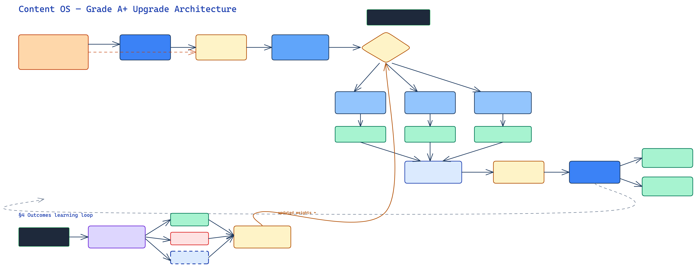

# gtm-engine (Open Source)

<p align="center">
  <strong>Sprache / Language:</strong>
  <a href="README.md">English</a> |
  <a href="README.zh-CN.md">简体中文</a> |
  <a href="README.ja.md">日本語</a> |
  <a href="README.es.md">Español</a> |
  <strong>Deutsch</strong> |
  <a href="README.ko.md">한국어</a>
</p>

<p align="center">
  <a href="https://github.com/henryroxstar/gtm-engine/stargazers"></a>
  <a href="https://twitter.com/intent/tweet?text=The%20open-source%20GTM%20agent%20harness%20for%20startups%3A%2063%20skills%2C%20zero%20auto-spam%2C%20runs%20locally%20in%20Claude%20Code%20or%20Antigravity.&url=https%3A%2F%2Fgithub.com%2Fhenryroxstar%2Fgtm-engine"></a>
  <a href="LICENSE"></a>
  <a href="https://www.python.org/"></a>
  <a href="https://docs.anthropic.com/en/api/agent-sdk/overview"></a>
  <a href="https://modelcontextprotocol.io/"></a>
  <a href="#warum-das-system-so-aufgebaut-ist"></a>
  <a href="#unterstützte-workspaces-und-umgebungen"></a>
</p>


*Das Open-Source-Agent-Harness für B2B-Software-Startups. Entwickelt, um Vertrieb, Pre-Sales und Marketing in der Frühphase um das Zehnfache zu beschleunigen.*

```
      .-"""-.
     /  o o  \        Ein Gehirn, viele umsichtige Hände —
     \   ^   /        Jeder Kontakt und Post erfordert deine Freigabe
      )-----(
     / /| |\ \
    ( ( | | ) )
     \_/ | \_/
        `-`
```

### Du bist der Gründer. Du bist auch das gesamte Go-To-Market (GTM)-Team.

In der Frühphase eines Startups trägst du jeden Hut, arbeitest mit knappen Ressourcen und suchst unermüdlich nach dem Product-Market-Fit (PMF). Deals abzuschließen war nie die einzige Aufgabe: Du musst die Vertriebspipeline eigenhändig aufbauen, das ungefilterte Feedback der Kunden zurück in die Produktentwicklung tragen, bei Kundenterminen ein noch nicht fertiges Produkt überzeugend präsentieren (ohne jedes Mal einen Entwickler hinzuziehen zu müssen) und Woche für Woche neue Botschaften testen, um Zielkunden anzuziehen.

Das sind fünf Vollzeitstellen. Der klassische Rat lautet: "Stell fünf Leute ein." Doch alles, was du hast, sind dein Laptop, dein bestehendes KI-Abonnement (Claude Desktop, Google Antigravity, Cursor oder Codex) und deine Zeit.

**gtm-engine ist das System, das diese fünf Aufgaben gemeinsam mit dir meistert.** Gezielte Kaltakquise, Vorbereitung auf Kundengespräche, strategische Account-Pläne, Pitch-Präsentationen, wöchentliche Marktradar-Analysen und markenkonformer Multichannel-Content (LinkedIn-Beiträge, Fachartikel, Podcast-Skripte, Infografiken) — alles gesteuert durch einen einzigen Satz im Chat, in deiner unverwechselbaren Markensprache und fundiert auf deiner realen Unternehmenswissensbasis.

Entscheidend ist: **Das System ist architektonisch so konstruiert, dass der Agent strukturell unfähig ist, eigenmächtig E-Mails zu versenden, Beiträge zu veröffentlichen oder sensible Daten nach außen zu leiten.** Es verlangt kein blindes Vertrauen, sondern schließt Überschreitungen technisch aus.

Drei unverrückbare Prinzipien:
1. **Kein Versand und keine Veröffentlichung ohne deine explizite Freigabe.**
2. **Die Daten jedes Unternehmens bleiben strikt getrennt im eigenen Profilverzeichnis.**
3. **Der Agent besitzt keine unkontrollierten Raw-HTTP- oder Shell-Rechte.** Sämtliche Interaktionen laufen ausschließlich über abgesicherte MCP-Werkzeuge (Model Context Protocol).



---

### Warum gtm-engine? (Architekturvergleich)

| Kriterium | Intransparente "AI SDR"-Plattformen (11x, Artisan etc.) | Reine Prompt-Chats (ChatGPT / Claude) | Generische Agent-Frameworks (CrewAI / LangChain) | **gtm-engine (Dieses System)** |
|---|---|---|---|---|
| **Kosten** | \$500 – \$3.000 / Monat | \$20 / Monat (verbunden mit hohem manuellem Kopieraufwand) | Token-Verbrauch + Serverkosten | **\$0 Basis** (nutzt dein bestehendes Workspace-Abonnement) |
| **Outbound-Sicherheit** | Automatischer Kaltversand (hohes Reputationsrisiko) | Manuelles Kopieren & Prüfen | Weitgehende Werkzeug-Berechtigungen | **Verbindliche menschliche Freigabegates** (kein Auto-Versand) |
| **Unternehmenskontext** | Oberflächliches Web-Scraping | Kontext muss ständig neu eingefügt werden | Aufwendige Vektor-DB-Infrastruktur nötig | **Profil als "Second Brain"** (einmal anlegen, in allen Skills verfügbar) |
| **Workflows** | Ausschließlich Kaltakquise per E-Mail | Nur reiner Text | Erfordert individuelles Programmieren komplexer Graphen | **63 Skills & 10 Workflows** (Video, Decks, Social Media, SDR) |
| **Datenschutz & Souveränität**| Bindung an Drittanbieter-Cloud | Daten können für Modelltraining genutzt werden | Stark abhängig vom Setup | **100% lokal & Git-ignoriert** (Daten verbleiben auf deinem Rechner) |

---

### 30-Sekunden-Schnellstart

```bash
# 1. Repository klonen
git clone https://github.com/henryroxstar/gtm-engine.git && cd gtm-engine

# 2. Ordner im bevorzugten KI-Workspace öffnen (Claude Desktop, Google Antigravity, Cursor oder Codex)

# 3. Im Chat eingeben:
"set me up" --site deinedomain.de
```
*Für den ersten Start werden weder Docker, Hintergrundserver noch Drittanbieter-API-Schlüssel benötigt.*

---

## Funktionsweise in der Praxis (See it work)

Keine komplizierten Installationsbefehle, keine manuellen Konfigurationsdateien vorab. Du öffnest das Projekt und formulierst eine kurze Anweisung. So wird aus einem typischen To-do am Montagmorgen ein fertiges Arbeitsergebnis:


Vor sechzig Sekunden standest du vor einem leeren Editor; jetzt hast du einen fundierten, professionellen Beitrag, dessen Wortlaut du vor Verlassen deines Rechners persönlich bestätigt hast.

Das gleiche Prinzip steuert deine gesamte Woche:

---

## Der passende Einstieg

| Dein Hintergrund | Empfohlener Pfad | Zeitaufwand |
|---|---|---|
| **Nicht-technisch** —— Fokus auf Vertrieb und Business, nicht auf Code | [`END-USER-ONBOARDING.md`](END-USER-ONBOARDING.md) (ohne Terminal oder Konsolenbefehle) | ca. 30 Min. |
| **Entwickler / Techniker** —— Direkte Steuerung über Chat oder Konsole | [Erste Schritte (Chat-Modus)](#erste-schritte-chat-modus) | ca. 10 Min. |
| **Architektur-Evaluierer** —— Fokus auf Sicherheit, Steuerung und Design | [Warum das System so aufgebaut ist](#warum-das-system-so-aufgebaut-ist) | ca. 10 Min. |

---

## Vier Betriebs- und Integrationsmodi

gtm-engine stellt einen gemeinsamen Kern (`gtm_core`) über vier Oberflächen bereit:

**1 · Chat-Modus (Standard — Keine Infrastruktur erforderlich)**
Öffne dieses Verzeichnis in deinem KI-Workspace (**Claude Desktop**, **Google Antigravity**, **Cursor** oder **Codex**) und tippe `"set me up"`. Alle Fähigkeiten laufen lokal, nutzen dein hinterlegtes Profil und formulieren in deiner Stimme. Kein Server, kein Docker, keine Datenbank nötig. → [Erste Schritte (Chat-Modus)](#erste-schritte-chat-modus)

**2 · Autonomer Self-Hosted-Agent (24/7-Betrieb)**
Betreibe die auf dem **Claude Agent SDK** basierende Umgebung lokal oder auf einem **VPS**: Sie führt den Workflow aus Analyse → Planung → Recherche → Erstellung rund um die Uhr aus und wartet an den Freigabegates in Telegram auf deine Bestätigung. Details in [`docs/DEPLOY.md`](docs/DEPLOY.md).

**3 · Client-REST-API-Entwicklung**
Starte das lokale FastAPI-Backend (`./scripts/stack.sh start`, Port `:8000`) mit PostgreSQL und Redis. Ausgelegt für Entwickler, die eigene Benutzeroberflächen, Dashboards oder mobile Apps anbinden.

**4 · Eingehender GTM-MCP-Server**
Stellt ausgewählte Werkzeuge über FastMCP HTTP (`deploy/Dockerfile.mcp`, Port `:8001`) mit API-Key-Authentifizierung (`sk-...`) bereit, um externe Agenten (externe Claude-Instanzen, LangChain, AutoGen oder CrewAI) anzubinden.

### Den richtigen Pfad wählen (Konflikte vermeiden)

| Pfad | Zielgruppe | Ausführung | Was zu vermeiden ist |
|---|---|---|---|
| **Chat-Modus (Standard)** | Gründer, Vertriebs- und Marketingteams | Repo im Workspace öffnen $\rightarrow$ `"set me up"` eingeben | **Kein** Docker starten, **nicht** `./scripts/stack.sh` ausführen. Komplett serverlos! |
| **Self-Hosted-Agent** | Teams mit Bedarf an 24/7-Automatisierung | Docker Compose via [`docs/DEPLOY.md`](docs/DEPLOY.md) | Nicht für spontane Chat-Interaktionen gedacht; läuft autonom über Telegram-Gates. |
| **Client-API-Entwicklung** | Entwickler von Web- oder Mobile-Frontends | `./scripts/stack.sh start` ausführen | Nicht starten, wenn du nur mit den Skills im Chat arbeiten möchtest. |
| **Eingehender MCP-Server** | Bereitstellung für externe Agenten-Flotten | FastMCP-Container auf Port 8001 bereitstellen | Niemals ohne API-Key-Schutz und Budgetbegrenzung öffentlich freigeben. |

### Unterstützte Workspaces und Umgebungen

| Workspace / Harness | Support-Status | Skill-Ladeverfahren | Anmerkungen |
|---|---|---|---|
| **Claude Desktop / Code** | Nativ | Plugin-System (`plugin/`) | Vollständige Unterstützung aller 63 Skills, MCPs und interaktiver Gates |
| **Google Antigravity** | Nativ | Automatisch via `.agents/` | Multi-Agent-Workflows, native Befehlsausführung und Dateiverwaltung |
| **Cursor / Codex** | Voll kompatibel | `.agents/AGENTS.md` + Regeln | Interaktiver Dialog; Aufruf der Skills über Standard-Prompts |
| **Headless VPS (Agent SDK)** | Dedizierte Umgebung | Containerisierte Agent-Schleife | Autonomer 24/7-Betrieb gesteuert über Telegram-Freigaben |

---

## Erste Schritte (Chat-Modus)

**Voraussetzungen:** Python 3.11+ und [`uv`](https://docs.astral.sh/uv/). Im Chat-Modus unterstützt dich der Agent im ersten Schritt bei der automatischen Einrichtung.

**Schritt 1 — Initialisierung von Engine und Unternehmensprofil (Profile)**
Gib im Chat `"set me up"` ein. Das System führt eine Umgebungsprüfung durch und erstellt anhand deiner Website-URL automatisiert das Unternehmensprofil (Markenidentität, ICP, Wettbewerber, Produkte).

**Schritt 2 — Werkzeuge und API-Schlüssel konfigurieren (Optional)**
Alle externen Integrationen sind optional (standardmäßig greift das System auf schlüssellose Web-Suchen zurück):
- **Akquise-Konnektoren** (Vibe, RocketReach, Apollo): Für verifizierte geschäftliche Kontaktdaten und Kaufsignale.
- **Web-Scraping-Konnektor** (Firecrawl): Für strukturierte Extraktion dynamischer Webseiten.
- **Budget-Obergrenzen festlegen**: Setze Monats- und Pro-Run-Limits. Jede kostenpflichtige Anfrage wird vor der Ausführung verifiziert.

#### Diagnosebefehl (`check_env`)
Überprüfe mit folgendem Befehl den Zustand deines Profils, der Konnektoren und der Budgets:
```bash
uv run python -m gtm_core.check_env
```

---

## Häufige Aufgaben (Schnellzugriff)

| Gewünschtes Ziel | Eingabe im Chat | Aufgerufene Skills | Generierte Ergebnisse |
|---|---|---|---|
| **Zielkunden und Entscheider identifizieren** | `"find prospects in [Branche/Markt]"` | `prospect`, `draft-outreach` | Bewertete Zielliste, CRM-kompatible CSV, geprüfte Kontakte |
| **Wichtige Kundentermine vorbereiten** | `"prep me for my call with [Firma]"` | `call-prep`, `account-dossier` | 5-Minuten-Briefing, SPIN-Fragenkatalog, passende Referenzen |
| **Fundierte Social-Media-Beiträge erstellen**| `"draft my LinkedIn post about [Thema]"` | `content-radar`, `content-studio` | 3 Hook-Optionen (Gate 1) $\rightarrow$ formal geprüfter Post (Gate 2) |
| **Fachlich fundiert in Diskussionen antworten** | `"reply to this post: [URL]"` | `linkedin-reply`, `reddit-reply` | Konstruktiver Fachbeitrag ohne Werbeton (zur Freigabe) |
| **Technisches Lösungskonzept ausarbeiten** | `"design the solution for [Firma]"` | `solution-discovery`, `solution-design`| Formelles Solution Architecture Document (SAD) mit Diagrammen |
| **Strategischen Account-Plan aufstellen** | `"build an account plan for [Firma]"` | `account-plan` | MEDDPICC-Analyse, Stakeholder-Matrix, Meilensteinplan |
| **System- und Profilzustand überprüfen** | `"run environment check"` | `check_env` CLI | Statusbericht zu Profilen, API-Schlüsseln und Budgetschutz |

> Eine vollständige Aufstellung aller 63 Skills findest du in [`docs/SKILLS.md`](docs/SKILLS.md).

---

## Warum das System so aufgebaut ist

1. **Zwei verbindliche Freigabegates verhindern automatischen Versand.**
   Jeder Durchlauf stoppt automatisch an **Gate 1** (Themenauswahl) und **Gate 2** (Inhaltsfreigabe). Ein systemweites `autopublish: false` stellt sicher, dass keine Information ohne deine Prüfung versendet wird.
2. **Strikte Trennung mehrerer Unternehmensprofile.**
   Jedes Profil liegt in einem separaten Verzeichnis (`profiles/<profil>/`). Dieselbe Installation kann gefahrlos für verschiedene Unternehmen genutzt werden.
3. **Das Sprachmodell denkt; MCP-Server handeln.**
   Der Agent führt keine direkten Netzwerkanfragen aus. Alle Aktionen laufen über definierte MCP-Schnittstellen. Zugangsdaten gelangen niemals in den Kontext des Sprachmodells.
4. **Keine fest codierten Firmenangaben.**
   Der Code ist vollständig generisch; Unternehmenskontext und Stilrichtlinien werden dynamisch aus dem jeweiligen Profil geladen.

---

## Star History

[](https://star-history.com/#henryroxstar/gtm-engine&Date)

---

## Lizenz

Dieses Projekt ist unter der **Apache License 2.0** lizenziert — siehe [`LICENSE`](LICENSE) für weitere Einzelheiten.
