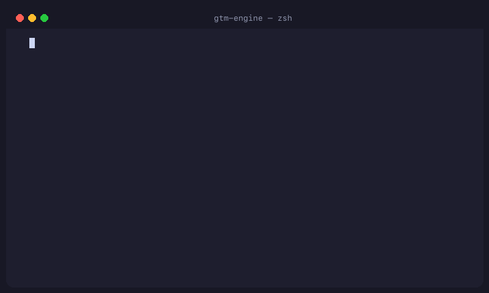
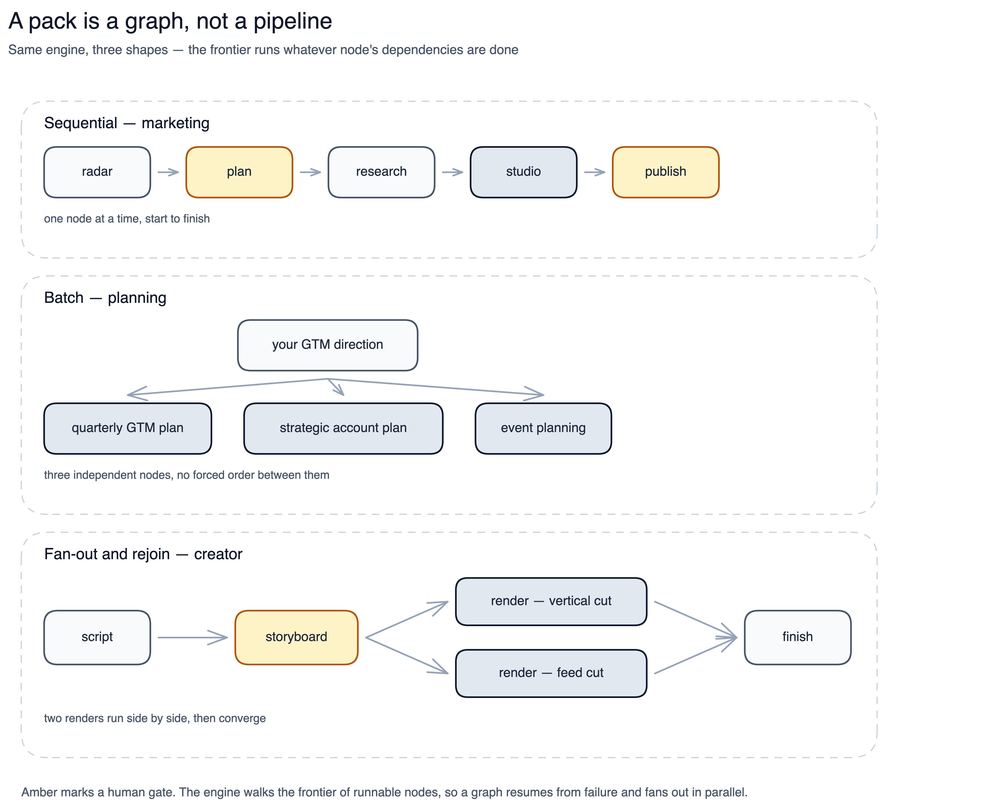
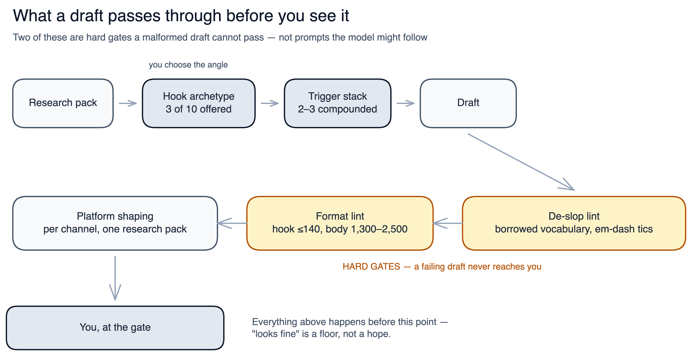
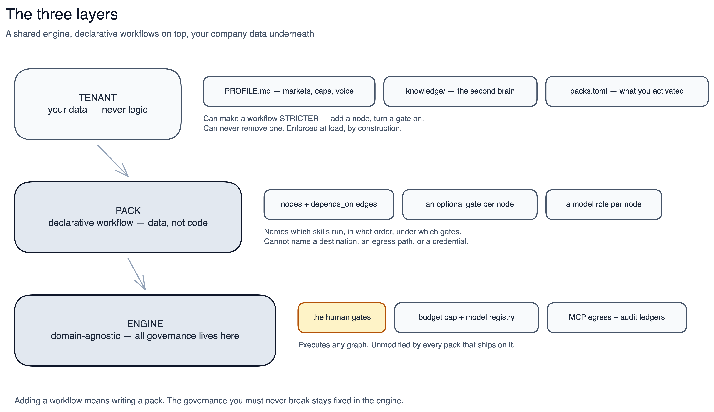

# GTM Engine

<p align="center">
  <strong>Language:</strong>
  <strong>English</strong> |
  <a href="README.zh-CN.md">简体中文</a> |
  <a href="README.ja.md">日本語</a> |
  <a href="README.es.md">Español</a> |
  <a href="README.de.md">Deutsch</a> |
  <a href="README.ko.md">한국어</a>
</p>

<p align="center">
  <a href="https://github.com/henryroxstar/gtm-engine/stargazers"></a>
  <a href="https://twitter.com/intent/tweet?text=The%20open-source%20GTM%20agent%20harness%20for%20startups%3A%2078%20skills%2C%20zero%20auto-spam%2C%20runs%20locally%20in%20Claude%20Code%20or%20Antigravity.&url=https%3A%2F%2Fgithub.com%2Fhenryroxstar%2Fgtm-engine"></a>
  <a href="LICENSE"></a>
  <a href="https://www.python.org/"></a>
  <a href="https://docs.anthropic.com/en/api/agent-sdk/overview"></a>
  <a href="https://modelcontextprotocol.io/"></a>
  <a href="#why-its-built-this-way"></a>
  <a href="#profiles-multi-company"></a>
  <a href="#workspace--harness-support"></a>
</p>


*The open-source Go-To-Market agent harness for B2B software startups. Built to 10x early-stage startups across their sales, pre-sales, and field-marketing activities.*

<p align="center">
  
</p>
<p align="center"><em>From zero setup to staged outbound in 30 seconds — you approve every reach</em></p>

### You're the founder. You're also the entire Go-To-Market (GTM) team.

You wear every hat, you're running lean, and you're still hunting for product-market fit. So closing
deals was never the whole job. You also have to *build* the pipeline that feeds those deals. You have
to carry the voice of the customer back into the building so the product actually bends toward PMF.
You have to sound fluent about a product that isn't fully built and whose docs went stale two sprints
ago — without dragging an engineer into every call. And every week the market moves, so every week
you're testing new messaging, reading the signals, and shipping content to pull the right buyers
toward you.

That's five jobs. The playbook says hire five people. You have a laptop, your existing AI workspace
(Claude, Google Antigravity, Cursor, or Codex), and this week.

**GTM Engine is the harness that runs those five jobs with you.** Cold prospecting, call prep, account
plans, decks, market scans, and on-brand multi-platform content (LinkedIn posts, blog articles,
podcasts, images) — all driven from a sentence you type, all in your voice, off your real company
knowledge. And it runs as an AI agent that _structurally cannot_ publish, send, or leak on its own.
It doesn't ask for your trust; it's built so it can't overreach.

Three things never change: nothing sends or publishes without your exact sign-off, each company's
data stays isolated in its own profile, and the agent has no raw HTTP or shell access. Most agent
frameworks ask you to trust broad permissions; this one is built so there's nothing broad to trust.
(The [how and why](#why-its-built-this-way) is spelled out further down.)

### Why GTM Engine? (The Architectural Contrast)

| Capability | Black-Box "AI SDR" Platforms | Raw Prompts (ChatGPT / Claude) | Generic Agent Frameworks | **GTM Engine** |
|---|---|---|---|---|
| **Cost** | \$500–\$3,000 / mo | \$20 / mo (heavy manual copy-paste) | Token spend + hosting fees | **\$0 base** (runs on your existing workspace — Claude, Antigravity, Cursor, or Codex) |
| **Outbound Safety** | Auto-sends cold emails (reputation risk) | Manual review | Broad tool permissions | **Non-bypassable human gates** (cannot auto-send) |
| **Company Context** | Rigid scraping | Re-pasting context every prompt | Custom vector DB plumbing | **Profile Second Brain** (onboard once, inherits everywhere) |
| **Workflow Variety** | Cold email only | Plain text only | Requires coding custom graphs | **78 skills & 11 packs** (video, decks, posts, SDR) |
| **Data Privacy** | Third-party cloud vendor lock-in | Shared training data | Varies | **100% Local / Gitignored** (data stays on your machine) |

**You onboard once.** Say `"set me up"` and point it at your website; it reads your site and drafts
your whole company profile (brand, ICP, voice, competitors, products), so every skill after that
already knows who you are and you never paste your company into a prompt again.

### 30-Second Quickstart

```bash
# 1. Clone the repository
git clone https://github.com/henryroxstar/gtm-engine.git && cd gtm-engine

# 2. Open this folder in your AI workspace (Claude Desktop, Google Antigravity, Cursor, or Codex)

# 3. Type in chat:
"set me up" --site yourcompany.com
```
*Zero Docker, zero background servers, zero API keys required for your first run.*

---

## See it work

No install command, no config file to fill out first. You open the folder and type one sentence.
Watch what a Monday-morning "I should really post something" turns into:


Sixty seconds ago you had a blank feed and a nagging to-do. Now you have a post that sounds like you
wrote it on a good day, backed by real research, and you signed off on every word before it left your
machine.

That same one-sentence move runs your whole week. Or run it as a routine schedule. Every run quietly
does the work of an analyst, a researcher, and a copywriter before it ever hands you anything.

*No black boxes, no silent failures, and no output leaves the system without a human opening the gate.*

Here's the part that compounds: these aren't isolated tricks. The dossier you generate becomes the
context for the email. Your industry and regulatory knowledge feed both. The signal that sparked a
post also times a prospect's outreach. Every skill feeds the next, so the more you run, the sharper
every run gets.

**Five jobs. One person. A sentence at a time.**

---

## Start here

**Three ways in. Pick the one that sounds like you:**

| You are… | Go to | Roughly |
|---|---|---|
| **Not technical** — you sell, you don't ship | [`END-USER-ONBOARDING.md`](END-USER-ONBOARDING.md) — install to first output with **no terminal and no commands**, plus a [Sales FAQ](docs/onboarding/SALES-FAQ.md) | 30 min |
| **Comfortable in a repo** — you'll drive it yourself | [Getting started](#getting-started-chat-mode), just below | 10 min |
| **Evaluating it** — architecture, control flow, security posture | [How it works](#how-it-works) → [For a technical evaluator](#for-a-technical-evaluator) | 10 min |

**The questions everyone asks first:**

| | |
|---|---|
| **What do I need?** | An active AI workspace (Claude Desktop, Google Antigravity, Cursor, or Codex). That is the whole requirement — every external tool is optional and falls back to keyless web search |
| **What will it cost me?** | Nothing beyond your existing workspace plan until *you* connect a metered data provider. You set a monthly and per-run cap during setup, and every paid call is checked against it **before** it runs |
| **Can it email or post without me?** | No — and not as a setting you could flip. Sending and publishing are not in the agent's tool surface at all; a human approves the exact bytes. [Why it's built this way](#why-its-built-this-way) |
| **Do I need Docker or background servers?** | No. If you're using Claude, Antigravity, Cursor, or Codex (Chat mode), you need zero infrastructure — no Docker, no databases, no servers. Local services are only for developers building client apps against the REST API |
| **Do I re-explain my company every time?** | No. You onboard once (`"set me up"`, pointed at your website) and every skill reads that profile from then on |
| **What can it actually do?** | [What it does out of the box](#what-it-does-out-of-the-box) for the workflows, [`docs/SKILLS.md`](docs/SKILLS.md) for the generated, always-current list of every skill |
| **Where does my data live?** | On your machine, in your profile. Runtime state is gitignored and never leaves except through a gate you approve |

**Contents** — [See it work](#see-it-work) · [Four ways to run & integrate](#four-ways-to-run-and-integrate) ·
[Getting started](#getting-started-chat-mode) · [Workspace support](#workspace--harness-support) · [Tools & keys](#tools--keys) ·
[What it does out of the box](#what-it-does-out-of-the-box) ·
[GTM skill suite](#gtm-skill-suite-78-skills--all-profile-driven) ·
[Content craft](#content-craft--what-makes-the-output-land) ·
[Profiles](#profiles-multi-company) ·
[How it works](#how-it-works) · [Repo layout](#repo-layout) ·
[Self-hosting](#self-hosting--publishing-advanced-mode) · [Development](#development)

---

## Four ways to run and integrate

One shared core engine (`gtm_core`), four integration surfaces. **Pick one — do not mix them.**

| Mode | Who it's for | How you run it | What NOT to do |
|---|---|---|---|
| **1 · Chat mode** *(default, zero infrastructure)* | Founders, sales and marketers driving from chat. This is what most people want | Open this folder in the **Claude Desktop app**, **Google Antigravity**, **Cursor** or **Codex** → say `"set me up"`. Every skill runs locally, against your profile, in your voice → [Getting started](#getting-started-chat-mode) | **Do not** start Docker, run `./scripts/stack.sh`, or deploy a VPS. Chat mode needs no background server at all |
| **2 · Self-hosted agent** | Teams wanting 24/7 unattended graph execution | The **Claude Agent SDK** runtime, local or on your own VPS, running any pack you have activated and pausing at the human gates in Telegram. A run starts from a clock, a signal, or a message you send. Needs Docker and a secret manager → [`docs/DEPLOY.md`](docs/DEPLOY.md) | **Do not** expect ad hoc chat here; it runs unattended behind Telegram gates |
| **3 · Client REST API** | Engineers building a custom frontend, dashboard or mobile client | Local FastAPI backend with Postgres + Redis on `:8000` (`./scripts/stack.sh start`), against OpenAPI routes `/v1/runs`, `/v1/packs`, `/v1/gates` → [Local Backend Stack](#local-backend-stack-fastapi--postgres--redis--mcp) | **Do not** run this just to use the skills in chat — mode 1 is serverless |
| **4 · Inbound MCP server** | Connecting third-party external agents (external Claude instances, LangChain, AutoGen, CrewAI) to GTM tools | Curated GTM Engine tools over streamable-HTTP FastMCP (`deploy/Dockerfile.mcp` on `:8001`) with `sk-...` API-key auth. For public deployments an edge MCP Gateway (`deploy/mcp-gateway/`) runs on Cloudflare Workers with subscription checks and KV caching | **Do not** expose this publicly without API-key auth, budget caps, and edge rate-limiting |

### Workspace & harness support

| Workspace / Harness | Support Level | How skills load | Notes |
|---|---|---|---|
| **Claude Desktop / Code** | Native | Plugin (`plugin/`) | Full support for all 78 skills, MCPs, and interactive gates |
| **Google Antigravity** | Native | Auto-discovered via `.agents/` | Multi-agent workflows, native `run_command` and file tools |
| **Cursor / Codex** | Supported | `.agents/AGENTS.md` + `.cursor/` rules | Interactive chat mode; skills invoke via prompt conventions |
| **Headless VPS (Agent SDK)** | Dedicated Runtime | Containerized agent loop | 24/7 autonomous graph execution behind Telegram human gates |

---

## Getting started (Chat mode)

**Prerequisites:** Python 3.11+ and [`uv`](https://docs.astral.sh/uv/). In Chat mode the agent installs
these for you in Step 1 — you don't run anything by hand.

**See onboarding work first** — the `"set me up"` run itself takes about two minutes, mostly the
engine doing the reading. Budget longer end to end: gathering the decks, case studies, and sample
posts you hand it afterwards is what makes the profile good, and that part is on you.

```
You:     "set me up" — here's our site: [yourcompany.com]

Engine:  reads your site and drafts your whole profile — company, ICP & personas,
         voice, competitors, content pillars, products, brand
      →  asks only the handful of things a website can't tell it (budget cap, which
         markets are in focus, sender identity for outreach)
      →  stages the full bundle for you to review — nothing goes live until you say
         so — then promotes it and proves it with a real first output.

From then on, every skill inherits that one profile — you never re-explain your company:
  · "find prospects"        already knows your ICP and scores against it
  · "draft my post"         writes in your voice, off your content pillars
  · "prep me for my call"   pulls your personas and matched proof stories
  · "run the VoC brief"     maps the field back to your Pain → Claim → Gain
```

You hand it your website once; brand, ICP, and voice flow from there into every run — so you're
never pasting your company into a fresh prompt again. The steps below are the same flow, in detail.

**Step 1 — Bootstrap the engine and your profile.**
Say `"set me up"`. The `setup` skill runs `bash scripts/bootstrap.sh` (installs `uv` if missing →
`uv sync` → environment self-check), then interviews you and scaffolds your company profile from the
`_template` bundle. *(Manual equivalent: `bash scripts/bootstrap.sh` — on Windows,
`powershell -ExecutionPolicy Bypass -File scripts\bootstrap.ps1`, which additionally probes that a
real interpreter is reachable rather than the Store-alias stub that shadows it on PATH.)* Onboarding through a different
surface (self-hosted Telegram, or the API)? See
[`docs/onboarding-surfaces.md`](docs/onboarding-surfaces.md) for what's identical and what differs.

**Step 2 — Configure your tools and keys (required — don't skip).**
`"set me up"` scaffolds your profile but it **does not add your API keys for you** — that's a manual
step, and it's where most of the value comes from. Decide which tools your work needs (see
[Tools & keys](#tools--keys) for what each one powers and why), then connect them:

- **Metered data connectors** (Vibe Prospecting, RocketReach, Apollo) — connect the OAuth connector or
  set the key when `setup` prompts you. These unlock real ICP discovery and *verified* contact
  email/phone; without them, prospecting falls back to unverified public web search.
- **Environment-variable keys** (`FIRECRAWL_API_KEY`, `DEEPSEEK_API_KEY`, and `ANTHROPIC_API_KEY`
  *only* if you'll run the pipeline programmatically) — copy `.env.example` → `.env` and fill in the
  ones you want. The repo config references only placeholders; **no key is ever written into it.**
- **Set your budget caps.** `setup` records a monthly and per-run cap so a metered tool can never
  quietly overspend — every paid call is checked against the cap *before* it runs.

#### Environment Doctor (`check_env`)

Run the built-in diagnostic doctor check to verify that your active profile, connectors, keys, and spend caps are resolved before running skills:

```bash
uv run python -m gtm_core.check_env
```

| Doctor Check | What it validates | If unconfigured |
|---|---|---|
| **Active Profile** | Confirms `profiles/<active>/` bundle, knowledge corpus, and `PROFILE.md` syntax | Warns if profile is missing; prompts to run `"set me up"` |
| **Metered Connectors** | Checks Vibe, RocketReach, and Apollo connector readiness | Gracefully falls back to keyless web search |
| **Spend Caps** | Verifies monthly and per-run ceilings are recorded in profile | Protects budget; blocks paid API calls until declared |
| **Model Registry** | Validates `gtm_core/models.toml` role mappings and endpoint availability | Defaults to workspace native model |

**Step 3 — Use the skills.**
`"run my prospecting"` · `"prep me for my call with [company]"` · `"run a market scan"` ·
`"build an account plan for [company]"` · `"run the content radar"` ·
`"draft my LinkedIn post about [topic]"`.

> **Running outbound?** The step-by-step procedure lives in the skill itself —
> [`plugin/skills/prospect/SKILL.md`](plugin/skills/prospect/SKILL.md) — with the discovery
> filters, credit model, and budget maths in
> [`references/discovery-and-budget.md`](plugin/skills/prospect/references/discovery-and-budget.md).
> The narrative operator's guide that ships with the private build is **not** part of this
> distribution: it cites internal backlog and retrospective docs that are deliberately excluded,
> so shipping it would mean shipping a guide whose links all dead-end.

> **What works with just your workspace plan:** every skill runs on your existing workspace subscription alone (Chat /
> workspace auth — no external API keys needed). Every external tool is *optional with a keyless fallback*,
> but Step 2 is what turns "runs" into "runs well" — connect the tools your skills actually depend on.

---

## Tools & keys

Every external tool is optional and falls back to keyless web search — but connecting the ones your
work depends on is what makes the output strong. Setup handles the connection; nothing is hardcoded.

| Tool | Powers | What it needs | Needed for | If you skip it |
|---|---|---|---|---|
| **Workspace AI plan** (Claude, Antigravity, Cursor, Codex) | the brain — orchestration, judgement, review, all skills | your workspace subscription / native model (workspace auth) | **Mode 1** (Chat) | required for Mode 1 |
| `ANTHROPIC_API_KEY` | the self-hosted agent's headless pipeline runs | API key in `.env` | **Mode 2** (advanced) | not needed for Chat mode |
| **Vibe Prospecting** | cold ICP company discovery, firmographics, company-level buyer-intent + events (`prospect`, `market-scan`, `events-tracker`) | OAuth connector (credit packs) — no key stored | Both | web search discovers instead |
| **RocketReach** | verified contact email/phone, news & hiring triggers, job-change timing, company intent (`prospect`, `call-prep`, `draft-outreach`) | `ROCKETREACH_API_KEY` (Doppler-injected; never in a file) | Both | Vibe enrichment → Apollo → public web (unverified) |
| **Apollo** | last-resort contact backstop (verified email, never phone), company buying-intent, job-posting signals (`prospect`) | OAuth connector (or `APOLLO_API_KEY` for the local tool). **Needs a PAID Apollo plan** — you can connect on free, but Apollo returns `API_INACCESSIBLE` for every data endpoint until you upgrade (verified 2026-07-27) | Both | falls back to public web (unverified) |
| **Firecrawl** | structured, JS-rendered web scraping (`content-radar`, `deck-research`, `events-tracker`) | `FIRECRAWL_API_KEY` | Both | built-in web tools |
| **DeepSeek** | cheap bulk first drafts (Claude always reviews) | `DEEPSEEK_API_KEY` | **Mode 2** (advanced) | a Claude worker drafts instead |
| **Media connectors** (Higgsfield · HeyGen) | carousel and infographic visuals, short-form video renders, the synthetic presenter (`carousel-visuals`, `video-render`, `video-avatar`) | OAuth connector in Claude — no key stored. **HeyGen is connector-only**: there is no headless HeyGen path, so the presenter lane needs Mode 1 | Both (HeyGen: Mode 1) | nothing is generated — the run routes to the live-action lane, which writes a phone-readable shoot list you film yourself |
| **Media API keys** (Gemini · Higgsfield · ElevenLabs) | the same renders on the *headless* path, plus podcast/voice TTS | keys in `.env` | **Mode 2** (advanced) | Mode 1 uses the connectors above instead |
| **Saleshandy** | the email sequencer — where `email-sequence` stages a multi-step sequence **paused**, and where the prospecting pack's `sequence-enroll` node pushes leads after you approve. Also the Do-Not-Contact list an opt-out is mirrored to | `SALESHANDY_API_KEY`, `SALESHANDY_DNC_LIST_ID` | Both | sequences are drafted as files; nothing is staged in a sender |
| **Syften** | community and social listening (`community-signal-analysis`, the Engagement pack, inbound signals) | `SYFTEN_API_KEY` | Both | keyless web search covers far less of the long tail |
| **Telegram** | **where you approve the gates in Mode 2.** Effectively required for the self-hosted agent — an unattended run with nowhere to ask simply stops at its gate | `TELEGRAM_BOT_TOKEN`, `TELEGRAM_ALLOWED_CHAT_ID` | **Mode 2** (advanced) | not needed for Chat mode — you are the gate |
| **Google Workspace** | reading and writing Docs/Drive deliverables | `GOOGLE_OAUTH_CLIENT_ID` / `_SECRET` / `_REFRESH_TOKEN` | **Mode 2** (advanced) | files stay on local disk |
| **Your own deck renderer** *(optional)* | automatic PDF/PNG export for `build-deck` / `carousel-pdf` / `carousel-auto`. The skills always write the deck as **[Slidev](https://sli.dev) markdown** — an open format you own. Pointing `DECK_RENDERER_URL` at a renderer you run lets the agent export it without you leaving the chat | `DECK_RENDERER_URL` → a small HTTP service you host that accepts `POST /export` and shells out to Slidev's CLI. The host must be on the SSRF allowlist (localhost and a `deck-renderer` service name are allowed by default) | Both | **you still get the whole deck** — just export it yourself with `npx slidev export` (add `--format png` for images). Nothing about the deck's content depends on this |

**Two notes on the Claude key.** `ANTHROPIC_API_KEY` also powers the **email judge**, which scores
every staged outreach row before enrollment. It is **key-first with an OAuth fallback**, chosen
automatically: with a key it calls the Messages API once per row; without one it runs through the
Agent SDK on your workspace auth and batches rows. Both stay on Claude — the judge reads rendered
bodies carrying prospect names and companies, so that binding is a privacy rule, not a cost one —
but the two paths are **not interchangeable for measurement**. The same key powers the **vision
worker**, a cheap image→text step so the brain never spends vision tokens.

**Budget caps** (`PER_RUN_CAP_USD`, `GTM_ONBOARDING_CAP_USD`, plus the monthly cap `setup` records
in your profile) are what Step 2 means by "set your budget caps" — every paid call is checked
against them *before* it runs.

Metered skills **estimate cost and check your cap before every paid call** — see
[`plugin/skills/prospect/references/discovery-and-budget.md`](plugin/skills/prospect/references/discovery-and-budget.md)
for the prospecting budget model.

---

## What it does out of the box

**11 packs ship in-repo, spanning 24 workflow variants** — each a wired **workflow graph** on the
same unmodified engine. A pack is just which skills run, in what order, under which gates. All
skills are shared, so a pack composes existing skills rather than owning them.



**A pack pauses only where your decision matters:** to commit a direction before work is spent
(approve the plan), to protect an expensive step (sign off frames before a video renders), or to
stop something leaving the system (a post, a reply, contacts loaded into your sender). One pause is
the norm and two the exception; a review that would only re-read finished work waits for the next
pause that guards something.

| Pack | For | Variants | External gate |
|---|---|---|---|
| **[Planning](#planning)** | Set your GTM direction before you execute | 1 | — documents only |
| **[Marketing](#marketing)** | Turn a real "why now" signal into on-brand written content | 3 | Gate 1 + Gate 2 |
| **[Creator](#creator)** | The same signal, as short-form **video** | 7 | Gate 1 + Gate 2 |
| **[Prospecting](#prospecting)** | Reach the right prospect, at the right time, with the right message | 1 | staged paused — you activate |
| **[Solution architecture](#solution-architecture)** | Use case → technical solution (pre-sales / SA) | 1 | — documents only |
| **Engagement** | Show up where buyers already are: `call-prep`, LinkedIn + Reddit replies (gated), community listening | 4 | reply variants gated |
| **Inbound** | A reply landed — `inbound-triage` classifies it and drafts a response behind the same human gate. A second variant handles the other kind of reply: someone asking to be left alone | 2 | gated draft, never auto-sends |
| **Knowledge refresh** | Re-reads your corpus and flags what has gone stale before a run leans on it | 1 | — writes to your profile only |
| **Market intelligence** | Continuous competitor/regulatory signals and weekly internal positioning read | 1 | — documents only |
| **Outcomes loop** | Feeds real results (replies, engagement) back so the next run is scored against what actually worked | 2 | — reads and records only |
| **Headless content** | Autonomous end-to-end content production across scan, plan, studio, and publish behind async signal queues | 1 | Gate 2 publish |


<details>
<summary><strong>Per-pack detail — deliverables, flow, and every gate</strong></summary>

### Planning

| **Planning** | Set your GTM direction before you execute |
|---|---|
| **Deliverables** | **Quarterly GTM plan** (market focus, ICP weighting, targets) · **strategic account plan** (buying-committee map, entry strategy, matched proof stories, a 5-step action plan with owners + dates) · **event planning** (weekly scan of conferences/meetups in your category, filtered by geography, per-event cost checked against your **travel policy**) |
| **Shape** | Batch — three independent nodes run side by side, no forced order between them |
| **Output & gates** | Documents / spreadsheets only. No external gate; nothing is published or sent. Travel policy is optional: event planning runs fine without one, it just skips the cost check |

### Marketing

| **Marketing** | Turn a real "why now" signal into on-brand content |
|---|---|
| **Channels** | LinkedIn post · long-form blog · X thread · podcast · builder-in-public update · customer case study |
| **Formats** | The studio step picks the asset per run: plain text, carousel, data infographic, or handwritten-style infographic. One workflow covers many formats |
| **Flow** | radar → plan → research → studio → publish (sequential; the blog variant fans research out into evidence + competitive, then rejoins) |
| **Output & gates** | The finished post or article. **Both gates apply**: you approve the plan (Gate 1), then the exact bytes before anything publishes (Gate 2) |

### Creator

| **Creator** | The same "why now" signal, rendered as short-form video |
|---|---|
| **Variants** | `short-form-video` (fully generated) · `presenter-video` (a disclosed synthetic presenter) · `live-action-video` (your own footage) · `repurpose-clips` and `restyle-shorts` (from existing video) · `demo-clips` (screen capture of your product) · `cross-modal-campaign` (one signal → text + image + video in a single fan-out) |
| **Flow** | Generated lanes: radar → plan → **brief** → **script** → **storyboard** → render → finish → score → publish. Render fans out (vertical + feed cuts, or presenter + inserts) and rejoins at `finish`. The **brief** settles the pre-spend decisions under the plan approval and adds no gate of its own: the cover, the structure, what stays constant across shots, whether a carousel would say it cheaper. Footage lanes skip the render half — `live-action-video` runs radar → plan → brief → script → **capture** → score → publish. `cross-modal-campaign` is the widest fan-out: radar → plan → **format-plan** → **text-studio** + **image-studio** + video-script in parallel → publish, so one signal becomes a post, an image and a video from a single approval rather than three runs |
| **Extra gates** | Beyond the two permanent gates, a generated lane adds a **storyboard** approval — you sign off the frames before anything renders, because rendering is the expensive part, and the gate ships a free **animatic**, those same frames held for each shot's real duration with the voice-over over the top, so you judge pacing rather than pictures. A footage lane has no storyboard at all: its extra approval is the **capture** gate, where you approve the exact source file before anything is uploaded |
| **Disclosure** | Any render using a trained likeness or cloned voice must carry your configured disclosure line, checked at staging **and** re-checked independently at the publish gate. A tenant that never configured one fails closed — this is EU AI Act Article 50, not house style |
| **Output & gates** | A finished, captioned, scored cut. **Both gates apply**, plus the lane's extra gate — storyboard on a generated lane, capture on a footage lane |

### Prospecting

| **Prospecting** | Reach the right prospect, at the right time, with the right message |
|---|---|
| **What it does** | Sources, enriches, and scores leads so your outreach lands where it should. Every account scored against **your** ideal customer profile, not a generic list |
| **Flow** | prospect → dossier → outreach → email-quality → **sequence (gated)** → **sequence-enroll** — one approval: you review the finished emails and the lead list together before anything reaches your sender. `sequence` drafts the enrolment plan and stops; `sequence-enroll` is the node that actually pushes the leads, and the agent never runs it — a Python-only dispatcher does, after you approve, because enrolling leads sends prospect details to a third-party processor |
| **Data sources** | **Vibe Prospecting** — discovery, firmographics, company-level buyer-intent. **RocketReach** — verified contact email/phone, news & hiring triggers, job-change timing. **Apollo** — last-resort contact backstop (email only), company buying-intent, job-posting signals. Fused into a "why now" heat signal. Free web search is the fallback when none are connected |
| **Output** | Scored brief · contact-ready outreach packs · HubSpot-ready CSV. Email drafts follow best-practice sequence structure (a real signal as the hook, a matched case study, one clear ask) and cite only public signals — intent times the touch, it never appears in the copy |
| **After a reply lands** | The `inbound` pack reads it (read-only), classifies intent (P0–P3), and drafts a reply behind the same human gate. Nothing auto-sends |
| **If they ask to be left alone** | The `optout-suppress` variant mirrors a detected opt-out onto your sender's Do Not Contact list. It is **add-only** — no removal effect exists, and none may be added, because nothing here may un-suppress a person who asked to be left alone |
| **Scheduling** | Bring-your-own Calendly: paste your booking link and drafts propose a time, the prospect books themselves. Optional CRM sync is your own Calendly upgrade, not a credential this system holds |
| **Output & gates** | The sequence is staged **PAUSED** in your sender. There is no resume tool on the connector — a human activates it |

### Solution architecture

| **Solution architecture** | Use case → technical solution (for pre-sales / SA) |
|---|---|
| **What it does** | Turns a use case into a technical solution, either mapped onto your flagship product (product-led) or synthesised as a bespoke custom build |
| **Flow** | discovery question bank → a pre-design scope check → a fan-out into the demo narrative and the solution design, which itself fans out post-design into a second scope check, the setup runbook, and the deck |
| **Under the hood** | Profiles the account's stack, produces brand-token architecture diagrams and a design doc that is lint-gated before it is delivered, and hands off to the deck, the runbook, or the Word skills. Alongside the chain: a commercial proposal (the AE's step, priced only after scope is confirmed), a security questionnaire answered only from the evidence pack, a quantified value case, a time-boxed POC plan, and a competitor battlecard |
| **Output & gates** | Documents only. No external gate; nothing is published |


</details>
---

## GTM skill suite (78 skills — all profile-driven)

Every skill is **company and product agnostic** — brand, voice, ICP, markets, and product all load
from the active profile bundle. Zero hardcoded company strings (CI-gated by `debrand_check.sh`).

### What are you doing today? (Quick start)

Start with your immediate task rather than memorizing the catalog:

| What you want to do | What to say in chat | Primary skills | Deliverable / Output |
|---|---|---|---|
| **Find ICP accounts & buyers** | `"find prospects in [market/vertical]"` | `prospect`, `draft-outreach` | Scored brief, HubSpot CSV, verified contact emails |
| **Prep for a high-stakes call** | `"prep me for my call with [company]"` | `call-prep`, `account-dossier` | 5-min briefing doc, SPIN discovery questions, matched case study |
| **Post something timely on LinkedIn** | `"draft my LinkedIn post about [news/topic]"` | `content-radar`, `content-studio` | 3 hook archetypes (Gate 1) $\rightarrow$ on-brand copy (Gate 2) |
| **Engage on Reddit or LinkedIn** | `"reply to this post: [URL]"` | `linkedin-reply`, `reddit-reply` | Value-first, non-promotional response staged for review |
| **Design an enterprise solution** | `"design the solution for [company]"` | `solution-discovery`, `solution-design` | Architecture SAD doc, problem $\rightarrow$ target diagrams, lint-gated before delivery |
| **Answer a security questionnaire** | `"answer this security questionnaire"` | `security-review` | Answers drawn only from your evidence pack — anything unbacked is refused with a named owner |
| **Quantify and prove the deal** | `"build the value case for [company]"` / `"plan a POC"` | `value-case`, `poc-plan`, `demo-narrative` | Baseline $\rightarrow$ modelled delta with an assumption register, a time-boxed POC with named verifiers, and a demo flow |
| **Compete honestly** | `"battlecard for [competitor]"` | `battlecard` | Where they win, where we win, the trap questions, and what we must not claim |
| **Design architecture diagrams** | `"design an architecture diagram for [product]"` | `diagram-design` | Publication-ready SVG/Mermaid diagrams and companion specs |
| **Audit SEO & research keywords** | `"audit our SEO for [domain]"` | `seo-audit`, `seo-keyword-research` | Technical SEO audit, keyword clusters, competitor analysis |
| **Govern sales pipeline & hygiene** | `"check CRM hygiene"` / `"review team pipeline"` | `crm-hygiene-check`, `team-pipeline` | **Needs a CRM connector, which this repo does not ship** — the skills preflight the category and refuse by name rather than reporting over nothing (`python -m gtm_core.connector_categories crm`) |
| **Build a strategic account plan** | `"build an account plan for [company]"` | `account-plan` | Buying influence map, MEDDPICC scorecard, 5-step action plan |
| **Check environment health** | `"run environment check"` | `check_env` CLI | Readiness audit of keys, profile, and spend caps |

> The full, always-current inventory is generated at [`docs/SKILLS.md`](docs/SKILLS.md) (one row per skill; CI fails if it drifts). The table below is a curated, categorized view.

| Category | Skills |
|---|---|
| **Prospecting** | `prospect`, `market-scan`, `events-tracker`, `draft-outreach`, `email-sequence`, `email-quality`, `inbound-triage` |
| **Account & call prep** | `call-prep`, `account-plan`, `account-dossier`, `deck-research`, `build-deck` |
| **Proof & partners** | `case-study`, `consulting-partner-brief`, `product-partner-brief`, `commercial-proposal` |
| **Content pipeline** | `content-radar`, `content-plan`, `content-research`, `content-studio`, `content-publish`, `format-router` |
| **Short-form video** | `video-router`, `creator-brief`, `video-plan`, `video-script`, `video-storyboard`, `video-preview`, `video-render`, `video-avatar`, `video-finish`, `video-score`, `video-clip`, `video-restyle`, `demo-capture`, `video-footage` |
| **Engagement** | `linkedin-engagers`, `linkedin-reply`, `reddit-reply`, `community-signal-analysis` |
| **Carousels & infographics** | `carousel-pdf`, `carousel-visuals`, `carousel-auto`, `infographic-data`, `infographic-handwritten` |
| **GTM planning & solution design** | `gtm-planning`, `campaign-plan`, `solution-discovery`, `solution-design`, `solution-scope-check`, `gateway-runbook`, `diagram-design` |
| **Pre-sales: prove, price, compete** | `security-review`, `value-case`, `poc-plan`, `demo-narrative`, `battlecard` |
| **SEO & organic growth** | `seo-audit`, `seo-competitor-analysis`, `seo-keyword-clustering`, `seo-keyword-research` |
| **Pipeline governance & CRO** | `crm-hygiene-check`, `deal-slip-scenario`, `metrics-review`, `team-pipeline` |
| **Market intelligence & research** | `market-harvest`, `market-intelligence`, `synthesize-research` |
| **Risk assessment** | `airq-scan` |
| **Founder journey** | `builder-radar`, `builder-evidence`, `builder-studio` |
| **Operations** | `setup`, `profile-onboard`, `identity-kit`, `knowledge-refresh`, `outcomes-sync`, `content-outcomes-sync` |

Switch profiles to run any skill for a different company: `"switch to <profile>"` → all skills now
target that profile's brand, ICP, and product.

---

## Content craft — what makes the output land

An AI that writes "on-brand" text is table stakes. What decides whether content gets opened, read
and shared is a set of specific techniques — and, more importantly, **which of them are enforced
rather than merely prompted for**.



Two of those steps are **hard gates**. A draft that fails the format linter never reaches you at
all — that is not a style suggestion the model might follow, it is a check a malformed draft fails
before you see it. So "looks fine" is a floor, not a hope.

| Technique | What it enforces | Why most tools skip it |
|---|---|---|
| **Virality engineering** | Six emotional triggers (identity, status, tribal belonging, productive discomfort, curiosity, aspiration), **stacked not checklisted** — one fires mild, two or three compound. Every draft passes a *felt test*; "useful but not felt" gets rewritten. B2B-recalibrated: tribal lines drawn on how well you do the work, never against a named competitor | Most tools optimise for *informative*, which is exactly why it scrolls past. Engineering the feeling on a B2B buyer without sounding like a hype-merchant is the hard part |
| **Hook optimization** | Every opening drawn from **10 named archetypes** — a shipped artifact, a counterintuitive decision, a named number, a status-quo fault-line. Must be zero-context self-contained and traceable to a real fact in that run's research. At the plan gate you get **3 candidates from 3 different archetypes**, so you choose the angle | A generic prompt produces a generic opening, and the hook is what earns the first three seconds |
| **Anti-AI prose craft** | **A hard gate.** A linter hunts the tells that make readers discount AI copy: borrowed model vocabulary (*delve, leverage, tapestry, seamless*), em-dash pause addiction, empty intensifiers, antithetical parallelism (*"It's not X, it's Y"*). Output must ground in a decision and its cost, a real number, an honest concession | Style is usually a prompt instruction, so the model complies on average and drifts under pressure |
| **Format & structure** | **A hard gate.** Exact per-format rules checked *before you see the draft*: LinkedIn needs a ≤140-char hook and a 1,300–2,500-char body; an X thread needs 5–9 tweets with the first standing alone, no link; a carousel needs 8–12 slides at ≤50 words with a re-hook partway | A malformed draft that reaches a human has already wasted the review |
| **Platform optimization** | Each platform gets its own *shape* from one shared research pack — you never re-research per channel, only re-shape. LinkedIn runs long with the link in the first comment; X opens stand-alone; Facebook caps near 480 characters before the fold; a reel scripts its hook for the first 1–2 seconds | Shrinking one draft to fit every channel is among the most common GTM content mistakes — what earns reach on LinkedIn actively hurts it on X |
| **News hijacking, safely** | The radar scores every item, then layers two judgment calls that never distort the base score: a **fault-line** check (is there a genuine arguable angle — never naming a competitor, skipped outright where it can't be taken safely, e.g. a tragedy) and a **velocity** check (is attention still rising, or already peaked) | Reacting to news is where brands look either tone-deaf or three days late |
| **True storytelling** | A theory-derived **9-beat story graph** for founder/builder narratives: a core value paired against its seductive counterfeit, a first decision that was wrong for sound reasons, conflict escalating inward (room → face → hands). Automated checks catch story-washing and unearned bragging | Generic accomplishment formulas read as bragging, which is the opposite of the intended effect |
| **Performance lexicon** | A prompt grammar for human expression in generated video: active facial regions capped at 1–2, micro-magnitude qualifiers mandated (*a fraction, a beat too long, barely*), positive stillness prescribed, expression kept distinct from body motion and vocal delivery | AI video fails in both directions at once — under-directed faces look numb, over-directed ones grimace in stock-photo melodrama |
| **Direct-response frameworks** | When the goal is conversion rather than brand affinity, drafts follow 5 B2B-calibrated desire frameworks that diagnose structural bottlenecks | The consumer-influencer version of this is comment-bait, which reads as cheap to a B2B buyer |


---

## Profiles (multi-company)

Each company is a **profile bundle** under `profiles/<slug>/` — the *tenant* layer, pure data:

```
profiles/
  _template/       starting point — copied to create a new company
  <your-company>/  your bundle:
    PROFILE.md     settings — markets, budget caps, cadence, voice toggle, output
    knowledge/     the "second brain" corpus — company · product · icp-personas · voice · case-studies
    products/      per-product knowledge overrides (resolved product-first)
```

The active profile is whatever the agent resolves at runtime. Switch with `"switch to <profile>"` /
`"use my <company> profile"`. Every skill reads brand, product, markets, and voice from the active
profile — never from `plugin/`. Create your own with `"set me up"`.

To confirm which tenant is currently active (useful before running anything that writes state,
especially when running several companies locally for demos):

```
uv run python -m gtm_core.profile status   # active profile + resolved content root
uv run python -m gtm_core.profile list     # every profile bundle found, active one marked
```

This is a read-only status check — it never switches a profile itself; that stays the operator's
call.

---

## How it works

GTM Engine runs GTM work as a **workflow graph**: the *engine* executes it, a *pack* defines it, and
your *profile* feeds it. That three-layer split is the whole design — a shared, domain-agnostic
engine, declarative domain workflows on top, and your company data underneath.

> **Reading the code?** [`docs/ARCHITECTURE.md`](docs/ARCHITECTURE.md) is the technical companion to
> this README — the layering, the four runtimes, the data contracts, and the invariants the system
> is built to hold.

Every pack variant is its own graph with its own starting point — a news signal, an ICP query, an
account, a reply that landed, a clock. See [Three workflows, one rule](#see-it-work) above for three
of them side by side, and note what that picture is really arguing: **a gate appears exactly where
something would otherwise leave the system, and nowhere else.** Five of the eleven packs produce
documents only and have no external gate at all.

**A run can also be started by a signal, not only by a clock or a person.** A recorded opt-out or
reply is dispatched as a run of the one-node `inbound` pack, which ends at a gate. That changes what
*starts* a run and nothing about what a run may *do*: a dispatch target is a `(pack, variant)` pair
with **no destination field**, so a signal — untrusted data — informs what is drafted and never
where anything goes. Because run count is then signal-driven rather than calendar-bounded, the
budget guard runs before **every** dispatch batch and a per-day ceiling bounds the lane; over either
limit a signal defers and is retried, never dropped.

```
   HOW EACH NODE RUNS

      your profile ──▶ [ AI model — the brain ] ──▶ [ MCP servers — the hands ]
     (brand·ICP·voice)   plans · reviews              the ONLY path outside
                         every node                   (web · scrape · render · publish)
```



Two
consequences worth spelling out, because they are what the picture is for:

- **A pack references skills; it never owns them**, so `build-deck` can appear in several packs at
  once and every pack runs on the *same* unmodified engine.
- **A gate that guards an external effect may name only one of three**: publish, enroll leads, or
  add to Do Not Contact. That set is closed, each member pairs with its own Python-only dispatcher
  the agent never calls, and the loader rejects anything else *before* a run starts.

### Why it's built this way


| Property | What it means | Why it exists |
|---|---|---|
| **Human gates are non-bypassable** | Nothing publishes, sends, or enrolls itself. `autopublish` is `false` everywhere, the destination is pinned server-side where the agent cannot reach it, and a pack that *declares* a gate pauses structurally — not because the skill cooperated | GTM output carries your name and your customers' data. A human approves the exact bytes |
| **Tenant state is isolated by construction** | Each company is its own profile with its own state, ledgers and customer data; the path-resolution spine binds every automated read and write to the active tenant. The hosted backend adds row-level security at the database | One engine serves many companies without their data silently mixing. The highest-risk error in GTM automation is *right content, wrong company* |
| **The model is the brain; MCP is the only hands** | No raw HTTP from the agent — every scrape, lookup, render and publish goes through an MCP tool | Least privilege by construction. Credentials live with the tools, not in the model's context, so a bad instruction in a scraped page cannot exfiltrate a key or reach an endpoint the tool surface does not expose |
| **Everything is profile-driven** | Brand, ICP, personas, voice, markets and budget all load from the active profile at runtime. Zero hardcoded company strings, CI-gated | One engine, many companies — and the wrong-company error becomes structurally hard to make silently |
| **New workflows are data, not code** | Adding a workflow means writing a pack — a graph of nodes wiring existing skills — which the engine validates and runs unchanged. No engine edits, no deploy | The domain logic you change most often stays in reviewable versioned config, while the governance you must never break stays fixed in the engine |

**Onboarding your knowledge is a first-class step**, not a property. Say `"set me up"` and the
engine ingests your materials — docs, URLs, notes — condensing them into a structured "second
brain" (company, ICP, voice, case studies) that every skill retrieves from, with a readiness check
that flags what is missing or stale before a run leans on it. That includes `market-scan`: it
auto-discovers a GTM plan, email sequence or account plan you have already built and focuses its
weekly sweep on the industries, use cases and buyer personas where you are actually selling,
instead of whatever is loudest in the news that week.

**In advanced mode** (the self-hosted agent), a cheap worker model (DeepSeek) handles bulk first
drafts to keep costs down, but **Claude always reviews** anything before it is shown or shipped,
and every gate-critical or PII-handling node stays on Claude by construction. Model choice resolves
through a committed registry (`gtm_core/models.toml`). Chat mode talks directly to your workspace's
native model — this tiering only applies when a self-hosted agent runs the workflow
unattended.

### For a technical evaluator

*Skip this if you're here to use it rather than to assess it.*

> GTM Engine is an **outer agent harness**. The
> [Claude Agent SDK](https://docs.anthropic.com/en/api/agent-sdk/overview) runs the inner loop — one
> session, model plus tools. GTM Engine owns the loop *around* it: what the model can see, what it can
> call, what runs next, and what can reach an external system.

Control flow lives in code, not in the model's context. The engine is a DAG scheduler: it advances a
frontier of runnable nodes, persists a run manifest at every transition, resumes a crashed run from
the first incomplete node, and dispatches fan-out concurrently under a single per-tenant lock. Spend
is capped by two independent mechanisms — a ledger check before every dispatch batch, and a hard
per-run ceiling at the SDK layer. The model runs inside a node and does not choose the next one, so a
bad generation produces a bad draft, not a bad run state.

Every tool call is adjudicated by a policy callback before it executes — fail-closed, with a
declarative deny floor beneath it. Publish and send are not in the model's tool schema at all. To
publish, the model emits bytes into a gate block; a human approves those exact bytes and Python makes
the call, to a destination pinned server-side. Email sequences are staged paused, and the sequencer
connector exposes no resume tool. A prompt injection cannot reach a capability the schema does not
contain.

The worst case for a bad model turn is a draft you reject. Every path to an external effect ends at a
human approving exact bytes, and no tool exists that skips that step.

Not done yet:
output-side DLP/PII moderation is a tracked gap, not a shipped control; and in advanced mode the
mechanical, no-PII nodes route to a non-US/EU inference endpoint.

---

## Repo layout

```
plugin/        gtm-engine plugin — the GTM skills, loaded by the Agent SDK
  skills/      one folder per skill; each has SKILL.md + references/
  .claude-plugin/plugin.json
.agents/       multi-agent configuration (AGENTS.md symlink, mcp_config.json, hooks.json for Antigravity & Codex)
profiles/      per-company bundles (the tenant layer — data only)
packs/         declarative workflow graphs — one folder per pack, graphs/<variant>.toml inside
gtm_core/      shared engine library (skills, graph runner, packs, profiles, ledgers, check_env)
agent/         Agent SDK app — brain, graph runner, session store, ledgers, publish, radar
cockpit/       Telegram bot + human-gate handlers (self-hosting only)
backend/       FastAPI multi-tenant backend (auth, runs, gate, entitlement enforcement) + schema/ migrations
mcp_server/    MCP server runtime — curated gtm_core tools, API-key auth, metering
deploy/        multi-tenant backend API stack — Docker Compose + tunnel config
scripts/       ops + dashboard scripts (incl. bootstrap.sh / bootstrap.ps1)
schemas/       JSON Schemas for the data contracts
tests/         content linter + contract tests + fixtures
docs/          design docs + DEPLOY guide + enforced rules (RULES.md) + platform playbooks
.env.example   every variable the system reads, grouped by tier (real .env is gitignored)
```

Runtime state (`content/<profile>/…`, ledgers) is **gitignored** and lives wherever the agent runs.


---

## Self-hosting & publishing (advanced mode)

Everything in this section is **Mode 2 / advanced mode** — not needed for Chat mode. The
autonomous pipeline, Docker Compose stack, secret management, Telegram cockpit, and the LinkedIn
publish gate (Gate 2) are documented in **[`docs/DEPLOY.md`](docs/DEPLOY.md)**.

Security posture (least-privilege tool surface, permanent gates, tenant boundary, publish-gate
design): [`CLAUDE.md`](CLAUDE.md).

How data is stored, scoped per tenant, and retired — files vs. database, the knowledge
lifecycle, ledgers, and the staging→promotion pattern: [`docs/gtm-data-infra.md`](docs/gtm-data-infra.md).

---

## Development

Working in the repo — dev setup, the CI gates your change must pass, and the invariants you must
not break: **[`CONTRIBUTING.md`](CONTRIBUTING.md)**. The enforced Python rules (§R1–§R19, most
CI-gated) live in [`docs/RULES.md`](docs/RULES.md).

CI runs the shell lint gates and `pytest tests/` on pull requests; use `uv run …` for everything
(`uv run pytest tests/ -q`, `uv run ruff check .`) — never bare `python`. Contributions are accepted
under the project's Apache-2.0 license (below).

### Local Backend Stack (FastAPI + Postgres + Redis + MCP)

> [!NOTE]
> **Who is this for?**
> You only need this stack if you are developing or testing your own client application against the FastAPI REST API. If you are interacting with GTM Engine through **Claude Desktop, Google Antigravity, Cursor, or Codex** (Chat mode), you do **not** need Docker or this stack — all skills run directly in your workspace with zero infrastructure.

To run the local backend server for client application development:
```bash
./scripts/stack.sh start       # on Windows: .\scripts\stack.ps1 start
./scripts/stack.sh status      # inspect container health & ports
./scripts/stack.sh seed        # create dev workspace & test tokens
./scripts/stack.sh stop        # shutdown cleanly (data preserved)
```
Zero external credentials needed (runs hermetically with fake run execution and local dev secrets).

---

## Star History

[](https://star-history.com/#henryroxstar/gtm-engine&Date)

---

## License

Licensed under the **Apache License 2.0** — see [`LICENSE`](LICENSE). Permissive use with an express
patent grant; you may use, modify, and distribute this software provided you retain the copyright
and license notices.
