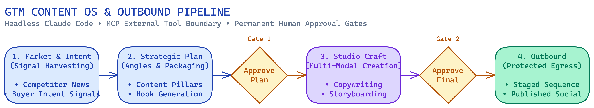
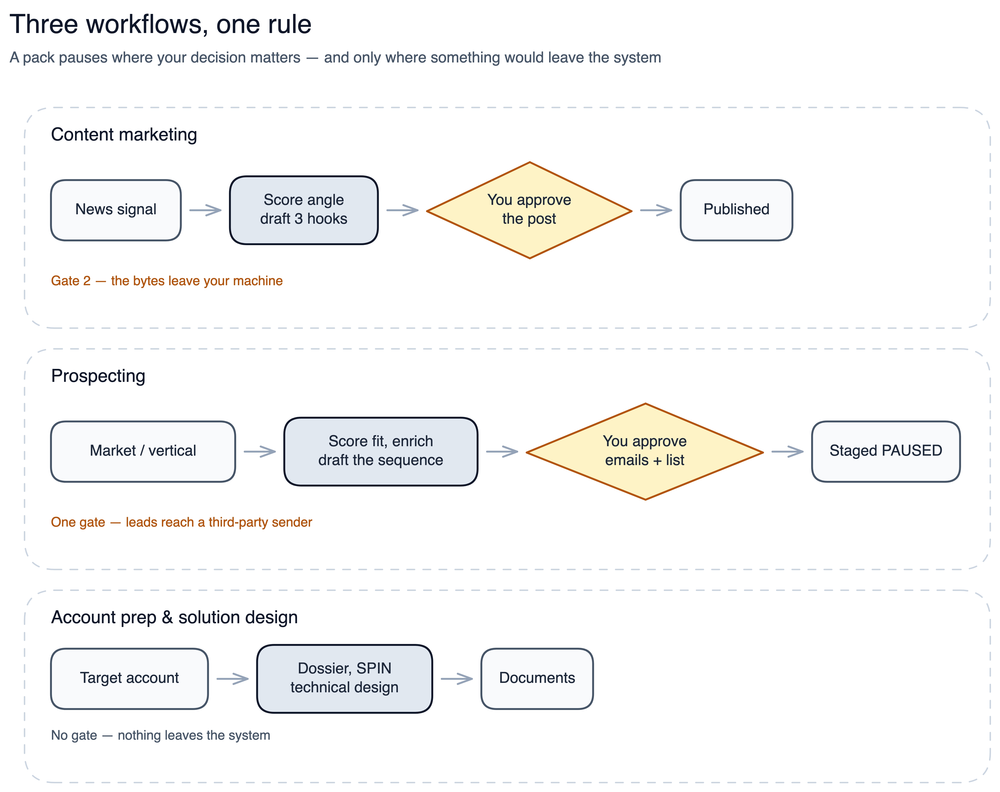
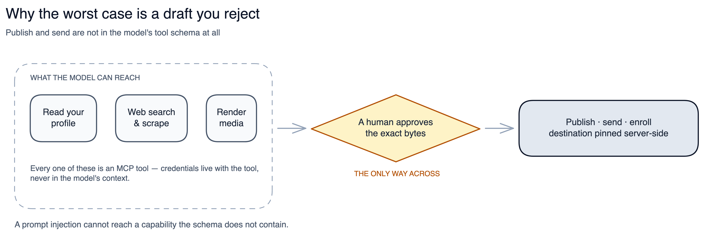

# gtm-engine (开源版)

<p align="center">
  <strong>语言 / Language:</strong>
  <a href="README.md">English</a> |
  <strong>简体中文</strong> |
  <a href="README.ja.md">日本語</a> |
  <a href="README.es.md">Español</a> |
  <a href="README.de.md">Deutsch</a> |
  <a href="README.ko.md">한국어</a>
</p>

<p align="center">
  <a href="https://github.com/henryroxstar/gtm-engine/stargazers"></a>
  <a href="LICENSE"></a>
  <a href="https://www.python.org/"></a>
  <a href="https://docs.anthropic.com/en/api/agent-sdk/overview"></a>
  <a href="https://modelcontextprotocol.io/"></a>
  <a href="#为什么采用这种架构"></a>
  <a href="#为什么采用这种架构"></a>
  <a href="#支持的-ai-工作区与环境"></a>
</p>



*面向 B2B 软件初创团队的开源 Go-To-Market (GTM) AI Agent 运行框架。助力早期初创公司在销售开拓、技术售前 (Pre-sales) 和市场营销活动中实现 10 倍效率提升。*

```
      .-"""-.
     /  o o  \        一个大脑，多双严谨的双手 ——
     \   ^   /        每一次触达与发布，都必须经你亲手批准
      )-----(
     / /| |\ \
    ( ( | | ) )
     \_/ | \_/
        `-`
```

### 你是创始人，同时也是整个 GTM 团队。

你身兼数职，资源精简，全力奔跑在寻找产品与市场契合点 (PMF) 的路上。签单从来不只是全部的工作：你必须亲手**搭建商机漏斗**；你必须把客户真实声音带回产研端，让产品向 PMF 靠拢；你必须在每次通话中流利介绍一个尚未完全成型、文档两周前就已过时的产品——同时还不能把工程师拖进每一次会议；每周市场风云变幻，你还要持续测试新话术、洞察行业信号、发布专业内容吸引目标采购者。

这是五个全职岗位的体量。传统的做法是招五个人。而你现在只有一台笔记本电脑、一个 Claude 订阅，以及这一周的时间。

**gtm-engine 就是陪伴你完成这五项工作的专业框架。** 自动化客户线索挖掘、会议深度背调、战略客户计划书、技术演示材料、每周市场雷达，以及全平台品牌内容创作（领英动态、深度博客、播客脚本、图表）——全部由你输入的一句话驱动，全部采用你的真实品牌语调，全部基于你公司的真实知识库。并且，它作为 AI Agent，**在底层架构上完全无法自行向外发送邮件、发布帖子或泄露数据**。它不需要你盲目信任，因为它的系统架构设计即保证了它无法越权。

三大铁律始终不变：
1. **未经你的明确审批，绝不发送任何邮件或公开发布任何内容**；
2. **每家公司的数据在各自专属 profile 中严格物理隔离**；
3. **Agent 严禁任何原生 HTTP 请求或未经审查的终端 Shell 执行权限**。绝大多数 AI 框架要求你赋予泛化的危险权限；本系统从根本上消除了需要盲目信任的漏洞隐患。

---

### 为什么选择 GTM Engine？（架构级优势对比）

| 核心维度 | 黑盒“AI SDR”商业平台 (如 11x, Artisan) | 原生 Prompt 对话 (ChatGPT / Claude) | 泛化 Agent 框架 (CrewAI / LangChain) | **GTM Engine (本系统)** |
|---|---|---|---|---|
| **使用成本** | 按席位或按联系人订阅 | 20 美元 / 月（伴随大量手工复制粘贴） | 纯 Token 费用 + 服务器部署成本 | **你现有的 AI 订阅**，外加你自选连接的数据提供方——计费调用执行前先核对预算上限 |
| **外发安全性** | 自动向目标客户发送冷邮件（极高声誉风险） | 手动逐条复制与审核 | 赋予模型泛化的工具执行权限 | **不可绕过的人类审批门禁**（模型完全无权自行发送） |
| **公司业务上下文** | 机械的外部网页爬取 | 每次对话重新粘贴公司背景 | 需要自行搭建向量数据库与外挂管道 | **Profile 第二大脑**（一次录入，全技能自动继承） |
| **覆盖工作流丰富度**| 仅局限于冷邮件发送 | 仅局限于纯文本生成 | 需自行编写复杂的代码与节点图 | **78 项预置技能 & 11 大工作包**（涵盖视频、PPT、文章、SDR） |
| **数据隐私与安全** | 数据存放在厂商云端 | 每次都粘贴进对话 | 视用户自建配置而定 | **本地文件，已 gitignore**——数据只经由你连接的工具离开 |

---

### 30 秒快速上手

```bash
# 1. 克隆代码仓库
git clone https://github.com/henryroxstar/gtm-engine.git && cd gtm-engine

# 2. 在你顺手的 AI 工作区中打开本项目（Claude Desktop、Google Antigravity、Cursor 或 Codex）

# 3. 在对话框中直接说出：
"set me up — here's our site: yourcompany.com"
```
*首次产出无需 Docker、后台服务器或 API Key。可直接发送的外联还需要连接一个联系人数据提供方。*

---

## 实际运行演示

无需繁琐的手工配置。打开工作区，输入一句话即可触发端到端流水线。看看周一早晨一句简单的“帮我发条领英”是如何执行的：



六十秒之前，你面对的是空白的屏幕与头疼的待办；现在，你获得了一篇基于深度调研、高度契合你专业水准的完整内容，并且每一个字都由你亲自核准。

同样的单句指令可以驱动你全周的核心工作：

---

## 从这里开始

| 你的角色或需求 | 推荐入口 | 预估耗时 |
|---|---|---|
| **非技术背景** —— 专注于业务销售而非代码 | 查看 [`END-USER-ONBOARDING.md`](END-USER-ONBOARDING.md)，无需终端与命令，包含常见答疑 | 30 分钟 |
| **技术人员 / 开发者** —— 喜欢在终端和本地驱动 | 查看下方的 [快速上手指南](#快速上手指南-chat-对话模式) | 10 分钟 |
| **技术选型评估者** —— 关注系统架构、控制流与安全性 | 查看 [为什么采用这种架构](#为什么采用这种架构) | 10 分钟 |

---

## 四种运行与集成方式

一套共享核心引擎（`gtm_core`），四种集成方式。**请只选其一，不要混用。**

| 模式 | 适合谁 | 如何运行 | 请勿这样做 |
|---|---|---|---|
| **1 · Chat 对话模式**（默认，零基础设施） | 在对话中驱动工作的创始人、销售与市场人员。这是大多数人需要的方式 | 用 **Claude Desktop**、**Google Antigravity**、**Cursor** 或 **Codex** 打开本文件夹，然后说 `"set me up"`。所有技能均在本地运行，读取你的档案，使用你的语气 → [快速上手指南](#快速上手指南-chat-对话模式) | **请勿**启动 Docker、运行 `./scripts/stack.sh` 或部署 VPS。对话模式完全不需要后台服务 |
| **2 · 自托管自主 Agent** | 需要 7×24 小时无人值守执行工作流图的团队 | 在本地或自有 VPS 上部署 **Claude Agent SDK** 运行时，执行你已启用的任意 pack，并在 Telegram 的人工审批门禁处暂停。运行可由定时器、信号或你发送的消息触发。需要 Docker 与密钥管理器 → [`docs/DEPLOY.md`](docs/DEPLOY.md) | **请勿**期待此模式下的即时对话；它在 Telegram 门禁后无人值守运行 |
| **3 · 客户端 REST API** | 构建自定义前端、仪表盘或移动客户端的工程师 | 本地 FastAPI 后端 + Postgres + Redis，端口 `:8000`（`./scripts/stack.sh start`），对接 OpenAPI 路由 `/v1/runs`、`/v1/packs`、`/v1/gates` | **请勿**仅为在对话中使用技能而启动它——模式 1 完全无需服务器 |
| **4 · 入站 MCP 服务器** | 将第三方外部 Agent（其他 Claude 实例、LangChain、AutoGen、CrewAI）接入 GTM 工具 | 通过 streamable-HTTP FastMCP（`deploy/Dockerfile.mcp`，端口 `:8001`）暴露精选的 GTM Engine 工具，使用 `sk-...` API Key 鉴权。公开部署时可用边缘 MCP 网关（`deploy/mcp-gateway/`），运行于 Cloudflare Workers，带订阅校验与 KV 缓存 | **请勿**在没有 API Key 鉴权、预算上限和边缘限流的情况下公开暴露 |

### 支持的 AI 工作区与环境

| 工作区 / Harness | 支持级别 | 技能加载机制 | 说明 |
|---|---|---|---|
| **Claude Desktop / Code** | 原生支持 | 插件系统 (`plugin/`) | 原生支持全部 78 项技能、MCP 工具与审批门禁 |
| **Google Antigravity** | 原生支持 | `.agents/` 自动发现机制 | 支持多 Agent 编排、原生 `run_command` 与文件工具映射 |
| **Cursor / Codex** | 完全兼容 | `.agents/AGENTS.md` + 规则配置 | 交互式对话体验；通过提示词直接调用底层技能 |
| **Headless VPS (Agent SDK)**| 专用容器环境 | 容器化 Agent 运行循环 | 配合 Telegram 审批机器人实现 24/7 自动化无人值守 |

---

## 快速上手指南 (Chat 对话模式)

**环境要求：** Python 3.11+ 以及 [`uv`](https://docs.astral.sh/uv/)。在 Chat 模式下，AI Agent 会在第 1 步自动协助你安装环境，无需手动折腾。

**第 1 步 — 初始化引擎与企业画像 (Profile)**
在对话框中键入 `"set me up"`。引擎会运行环境检查，随后通过简短交互，根据你的官网 URL 自动提炼并初始化你的专属公司画像。

**第 2 步 — 配置工具与密钥 (可选连接器)**
`"set me up"` 会搭建好你的 profile，所有外部数据提供商均为可选配置（默认优雅降级至免 Key 的公开网络搜索）：
- **商机挖掘连接器**（Vibe、RocketReach、Apollo）：提供已验证的商业邮箱与采购意向信号。
- **爬虫连接器**（Firecrawl）：提供动态页面深度解析能力。
- **设置预算硬上限**：在初始化时设定每月及单次运行的支出上限，系统在每次付费调用前都会自动校验额度，杜绝超额消耗。

#### 环境健康体检 (`check_env`)
运行内置的诊断命令，确保你的企业画像、外部工具连接与预算限额就绪：
```bash
uv run python -m gtm_core.check_env
```

| 检查项 | 验证内容 | 未配置时的处理机制 |
|---|---|---|
| **企业画像 (Profile)** | 校验 `profiles/<active>/` 目录完整性与语法 | 发出提醒并建议运行 `"set me up"` |
| **商机拓展连接器** | 检查 Vibe、RocketReach、Apollo 凭证状态 | 自动平滑降级至公开网络搜索模式 |
| **预算支出上限** | 确认每笔及每月调用支出保护限额 | 严格阻止任何潜在计费调用，保护钱包 |
| **模型调度注册表** | 检查 `gtm_core/models.toml` 端点可用性 | 默认采用当前工作区的原生接入模型 |

---

## 今天想做什么？（核心任务快速索引）

直接说出你当前的目标，无需刻意记忆技能清单：

| 你的即时目标 | 对 AI 说的话 | 触发的核心技能 | 输出交付物 |
|---|---|---|---|
| **挖掘高匹配客户与关键买家** | `"find prospects in [目标行业/市场]"` | `prospect`, `draft-outreach` | 评分客户简报、HubSpot CSV 表、经过验证的采购者联系方式 |
| **备战重要商业拜访或演示** | `"prep me for my call with [公司名]"` | `call-prep`, `account-dossier` | 5 分钟速读简报、SPIN 探询提问库、对标标杆案例 |
| **发布高质量领英或社交动态** | `"draft my LinkedIn post about [热点/话题]"` | `content-radar`, `content-studio` | 3 组候选切入角度 (门禁 1) $\rightarrow$ 格式严格质检的成稿 (门禁 2) |
| **在 Reddit / 领英专业讨论中互动** | `"reply to this post: [URL]"` | `linkedin-reply`, `reddit-reply` | 价值优先、不带营销味的专业回复方案（待你审核） |
| **撰写企业级解决方案设计书** | `"design the solution for [公司名]"` | `solution-discovery`, `solution-design`| 规范的技术架构设计文档 (SAD)，包含现状与目标架构图 |
| **制定年度/季度战略客户攻坚计划** | `"build an account plan for [公司名]"` | `account-plan` | 买方委员会角色图谱、MEDDPICC 记分卡、5 步落地执行计划 |
| **检查系统运行环境状态** | `"run environment check"` | `check_env` CLI | 全套密钥、画像健康度及预算防护审核报告 |

> 完整的 78 项技能目录请参阅 [`docs/SKILLS.md`](docs/SKILLS.md)。

---

## 为什么采用这种架构



| 特性 | 含义 | 为何如此设计 |
|---|---|---|
| **人工门禁不可绕过** | 任何内容都不会自行发布、发送或导入。全局 `autopublish: false`，发布目标固定在服务端、Agent 无法触及；pack 一旦*声明*了门禁，就会在结构上暂停——而非依赖技能的配合。**并非每个工作流都有两道门禁**：11 个 pack 中有 5 个只产出文档，完全没有对外门禁 | GTM 产出承载着你的署名与客户数据，必须由人来批准确切内容 |
| **租户状态天然隔离** | 每家公司拥有独立的档案、状态、账本与客户数据；路径解析中枢将每一次自动读写都绑定到当前租户。托管后端在数据库层面再加一层行级安全 | 同一引擎服务多家公司而数据互不串味。GTM 自动化中风险最高的错误就是「内容对了、公司错了」 |
| **模型是大脑，MCP 是唯一的手** | Agent 不发起任何原始 HTTP 请求——所有抓取、查询、渲染与发布都经由 MCP 工具 | 结构性最小权限。凭据与工具同在，不进入模型上下文，因此被抓取页面中的恶意指令既拿不到密钥，也够不到工具清单未暴露的端点 |
| **一切由档案驱动** | 品牌、ICP、人物画像、语气、市场与预算全部在运行时从当前档案加载，代码中零硬编码公司信息（CI 强制校验） | 一套引擎服务多家公司，且「内容对了、公司错了」这类错误在结构上难以悄然发生 |
| **新工作流是数据而非代码** | 新增工作流意味着编写一个 pack——由节点组成、串联既有技能的图，引擎校验后原样运行。无需改动引擎，也无需重新部署 | 最常变动的领域逻辑留在可审阅的版本化配置中，绝不可破坏的治理逻辑则固定在引擎里 |

## Star History

[](https://star-history.com/#henryroxstar/gtm-engine&Date)

---

## 开源协议

本项目采用 **Apache License 2.0** 开源许可协议 —— 详见 [`LICENSE`](LICENSE)。允许自由使用、修改和分发，并包含明确的专利授权条款。
