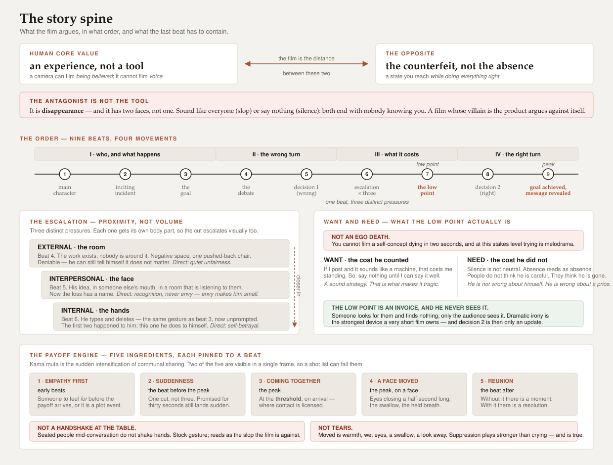

# Story graph — a beat order from theory, and what the payoff has to contain

> **Company-neutral.** This is the *mechanism* for shaping a piece that carries a protagonist. It
> carries no company facts and names no creator or channel. Whether an item is a story at all is
> decided upstream by `brief.protagonist` on the plan item; what the story may claim comes from the
> script's own verification log. Sibling of `content-plan/references/outlier-mining.md`, which
> supplies a structure from **evidence** where this one supplies a structure from **theory**.



## When this file applies

Only when the plan item carries `brief.protagonist`. Most items do not, and for those the
outlier-mined structure is the right and only answer. A story graph applied to an explainer
produces a nine-beat explainer, which is worse than the four-beat one it replaced.

## Decision 0 — the value and its opposite, which are chosen together

`core_value` and `opposite` are one decision made twice, and getting either wrong bends every beat
after it. Three rules:

- **The value is an experience, not a capability.** *Voice*, *reach*, *productivity* are
  instruments — things a person uses. A story cannot film an instrument being valued. Name the
  experience the instrument buys: *being known as yourself*, *being believed*, *belonging here*.
  The test: can a face show it happening? If not, you have named the tool.
- **The opposite is the value's counterfeit, not its absence.** *Silence* is not the opposite of
  voice; it is the absence of output, and absence has no drama because nobody chose it. The
  opposite of *being known as yourself* is *being indistinguishable* — a state you can arrive at
  while doing everything right, which is what makes it frightening.
- **Then the absence becomes what it actually is: a coping strategy.** Once the counterfeit is
  named, silence stops being the antagonist and becomes the protagonist's *defence against it* —
  a choice with a reason. A void is not dramatic. A self-protective choice is.

**The antagonist is never the product, and never the technology the piece is about.** A film whose
villain is the category it sells into argues against itself in front of the buyer. Where the
technology is genuinely the pressure, the antagonist is the **outcome both roads lead to** — use
the tool badly and disappear into the average; refuse it and disappear into the silence. Name that
destination and the product becomes the third road rather than the enemy.

## The graph — decision 2's second source of structure

`outlier-mining.md` finds a shape by reading what already outperformed. This file supplies one from
the form itself, for the case where the mined outliers are story-shaped and a beat order still has
to be committed to. It does not replace mining; it is what to commit to when mining has told you
*that* a story works here and not *how* it goes.

The order, nine beats:

```
main character → inciting incident → goal → debate → decision 1 →
escalating conflict (external, interpersonal, internal) → the low point →
decision 2 → goal achieved, and the message revealed by achieving it
```

Recorded in the brief as `outlier_structure` with the name written out and `source: model` — you
chose it from the form, you did not derive it from this run's outliers, and the provenance field
exists so that difference stays visible. `sampled` is omitted: nothing was sampled.

Three properties of the order are load-bearing, and each is the reason a beat is where it is:

- **Decision 1 is wrong, and made for reasons that looked sound.** It is what makes decision 2
  credible rather than lucky. A story whose first decision was already correct is an
  accomplishment piece.
- **The escalation is three distinct pressures, not one repeated** — external (the world),
  interpersonal (someone they need), internal (what they believe about themselves). Collapsing
  them into "it got harder" is how the middle of a piece goes slack.
- **The message is revealed by the goal being achieved, never stated beside it.** If the last beat
  has to explain what the story meant, the beats before it did not mean it.

Sized to the duration, this also satisfies the script's own rule that every beat carries a visual
change — the escalation alone is three of them, by construction.

## The escalation — proximity, not volume, and one body part each

A middle goes slack when "escalating" is read as *louder*. It means **closer**: each pressure lands
nearer to the protagonist and costs more to deny. Give each layer its own part of the body and the
cut escalates visually as well as narratively.

| Layer | In frame | Why it escalates | The emotion to direct |
|---|---|---|---|
| **External** | **the room** — the thing they made, and the negative space around it | Deniable. They can still tell themselves it does not matter. | Quiet unfairness. Play it with absence, not with a reaction shot. |
| **Interpersonal** | **the face** — two people, and the protagonist is not the one being listened to | The loss stops being hypothetical and acquires a name. An abstract loss can be rationalised; a named one cannot. | **Recognition, not envy.** *That was mine to say.* Envy narrows the eyes and makes them small and unlikeable; recognition is stillness, a small exhale, the gaze held a beat too long. |
| **Internal** | **the hands** — typing, stopping, the cursor, the delete | The first two happened *to* them. This one they do to themselves, unprompted. That is the whole escalation. | Self-betrayal. Repeat the exact gesture from the earlier beat; the repetition is the point, and needs no face at all. |

The interpersonal beat is the one that most often reads as merely sad rather than escalating. The
fix is never to make it bigger. It is to make the loss **specific and attached to a person** — and
to keep the protagonist sympathetic while it happens.

## Want, need, and what the low point actually is

The low point is where a short film most often reaches for machinery it cannot afford. Two
corrections, and both are about scale.

**Want and need are not "false self" versus "true self."** At this length that framing forces the
protagonist to have been wrong about *who they are*, and a self-concept cannot die on screen in two
seconds — attempting it is the melodrama the story-washing check exists to catch. The workable
reading is narrower and truer:

- **Want — the cost they counted.** A strategy that is genuinely sound on its own terms. *If I do
  this badly it will cost me standing, so I will not do it until I can do it well.* It has to be
  reasonable. That is what makes it tragic rather than stupid.
- **Need — the cost they did not count.** The price the strategy was quietly charging all along.
  They are not wrong about themselves. They are wrong about **a price**.

**So the low point is not a collapse. It is an invoice arriving.** The uncounted cost becomes
visible, specific, and attached to a person — a face, a name, a thing that did not happen.

Two consequences follow, and both are craft:

- **Stage it so the protagonist never sees it.** The strongest version is watched by the audience
  alone: someone looks for them and finds nothing, somewhere they are not. Dramatic irony is the
  most powerful device a very short film owns, because it buys the audience a feeling the
  character has not earned yet and cannot argue with.
- **Decision 2 is then not willpower.** It is a person updating on new information, and acting
  cheaply and immediately. Nothing heroic is required, which is exactly why it is believable — and
  it lets the piece's own answer arrive as relief rather than as a lesson.

## The five ingredients — what decision 7's payoff b-roll must contain

Decision 7 plans the b-roll list, because selection *is* the storytelling layer. For a story item,
the payoff beat's entry in that list is the one that decides whether the piece lands, and it is
checkable at the brief, before a frame is generated or shot:

1. **Empathy first.** A vulnerability shown early, so there is someone to feel *for* by the time
   the payoff arrives. A payoff for a protagonist the viewer has not been given a reason to care
   about is a plot event.
2. **Suddenness.** A reveal, not a ramp — and it is carried by the **cut and the sound**, not by
   the writing. It need not be *unexpected*: a reunion the viewer has been promised for thirty
   seconds still lands suddenly if it arrives in one cut rather than three. The beat before it
   must be quiet, or there is nothing for it to interrupt.
3. **People physically coming together.** Visible, in frame, two people in the same shot — and
   **staged where contact is socially licensed**, which is the threshold: an arrival, a door, the
   moment someone stands up. Contact invented mid-scene reads as a stock gesture, and a stock
   gesture in a payoff is fatal. *Seated people in the middle of a conversation do not shake
   hands.* If the only physical contact you can justify is a handshake at a table, the scene is
   staged at the wrong moment, not written with the wrong gesture.
4. **A face visibly moved — which is not a face crying.** The reliable markers are warmth and
   restraint: wet eyes with nothing falling, a swallow, a held breath, a look away, a hand to the
   chest or over the mouth, a laugh that arrives at the same time as the wet eyes. **Suppression
   plays stronger than release**, because the audience gets the feeling *and* the effort of
   containing it. It is also simply what adults do in public, in front of someone they have just
   met again — casting tears into an ordinary social setting reads as false and takes the rest of
   the film's honesty down with it. This one has a field: the payoff shot's `expression`. Write it
   **as muscles, not as an adjective** — *"moved"* renders as nothing at all. The script's own expression
   check (Step 1.6 check 4) is what refuses a blanket direction repeated across every shot, and a
   payoff beat whose `expression` reads *calm* is that defect in its story-format form.
   **Pick ONE of those markers, not the list.** The markers above are alternatives, and a beat that asks for all of
   them renders as anguish rather than restraint — a shipped payoff still asked for six at once
   and got exactly that. How to write one at the size an adult actually shows it, and which
   markers cancel each other out, is `references/performance-lexicon.md`.
5. **A reunion or a redemption arc.** The shape the other four hang on. Without it there is a
   moment; with it there is a resolution. Give it its own beat *after* the contact — the embrace
   is the peak, and the quiet shot of the two of them afterwards is what tells the viewer it holds.

**The check at the brief:** if the payoff beat's b-roll list holds neither of the two *visible*
ingredients — people coming together, a face moved — the beat cannot fire, whatever the script
says about it. Prose can promise an emotional payoff that the shot list has no way to deliver, and
that gap is invisible in the script and obvious in a still.

Two of the five are visible in a single frame, which is why they are also asked at the storyboard
gate rather than only here. The other three are properties of the order and are settled by the
graph above.

**One restraint holds the whole payoff together: the character who paid the invoice never mentions
it.** If they say what they saw — that they looked, and found nothing there — the film explains
itself and the feeling collapses into information. They say the small warm thing instead. The
audience is the only party holding both halves, and that is where the emotion lives.

## The visual hook — decision 9, story-shaped

Decision 9 fixes the first frame as a shot spec. For a story item the default is the
**flash-forward to the emotional peak**: the reunion frame, or the face at the moment it changes.

This is the *reveal the ending* archetype as a shot rather than a line, and it resolves the
apparent conflict between "the message lands last" and "state the premise in the first second".
Opening on the peak states the premise — *something happens to this person, and it matters* —
without stating the message. The rest of the piece is how they got there.

**Show the peak partial, and generate it second.** A flash-forward that shows the whole payoff has
spent it; frame a fragment — a face over a shoulder, a hand, a detail that promises without
resolving. And because it is a fragment *of* the payoff, the payoff frame is the one that gets made
first and the opening frame is delta-edited **from** it. Reversing that order is how a film ends up
with two people who are demonstrably not in the same room on the same afternoon.

Decision 9's general rule is "the familiar thing beside the novel one". Its story-format reading:
**the outcome beside the person it happened to**. Same subject as the cover, different job; no text
in frame.

## What this file does not do

- **It does not decide whether to tell a story.** That is `brief.protagonist`, set at Gate 1.
- **It does not replace the trigger stack.** The six triggers concern how a reader relates to an
  *idea*; the five ingredients concern how a viewer relates to a *person on screen*. Both, not one
  instead of the other.
- **It is not a gate.** Nothing here refuses a brief. The payoff-contents check is a question you
  answer while planning decision 7, and the honest answer "neither ingredient is in the list" is a
  finding to act on, not an error to route around.

*Provenance: the nine-beat order, the five ingredients and the flash-forward default are adapted
from a third-party storytelling-method course for commissioned corporate film, restated in this
system's terms and stripped of the film-production framing. Directional craft, same standing as
`content-plan/references/retention-rubric.md`'s dimensions — see that file's evidence note. No
number on this page comes from that source, and the course's own effectiveness claim is
deliberately not carried here because it is unsourced. The corrections above — the value/opposite
pairing rule, the low point as an invoice rather than an ego death, the proximity reading of the
escalation, and the staging of ingredients 3 and 4 — are this system's, arrived at by working the
form against a thirty-second cut and recorded here so the same argument is not had twice.*
