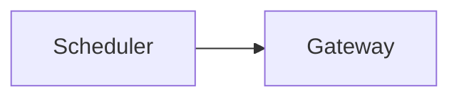

# Design note

*Fictional. Deliberately wrong: the tiers are out of order, the executive summary is absent,
no coverage dimension has a home, a stated count outruns its list, a diagram stands alone,
a matrix row is untagged, a design-target is written as live, a claim writes to something the
guardrails freeze, and one action is done by both actors.*

## Tier 2 — technical notes

Three limits worth stating:

- the gateway holds no clinical record
- the rule store is read-only at run time

## Tier 1 — buyer view

One page that the buyer reads, carrying none of the sections a reader needs.

## Guardrails

The rule store is read-only to us and stays in place for the whole engagement.

## Capability coverage

| Capability | Status | Note |
|---|---|---|
| Reconciliation at write time | Enforced | consulted on every booking |
| Cross-region reconciliation | Design-target | one region today |
| Discrepancy report |  | shown from fixtures |

Cross-region reconciliation validates every leg of the booking, in all four regions.

The gateway writes each verdict into the rule store on every booking.

The customer presents a session reference; we present it when the wallet is offline.
